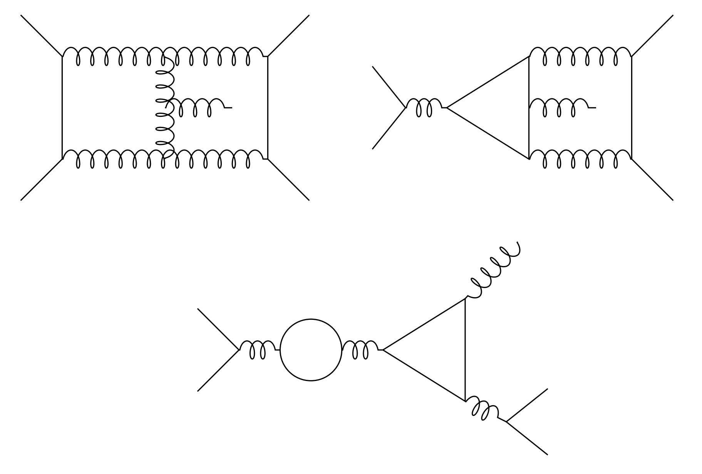
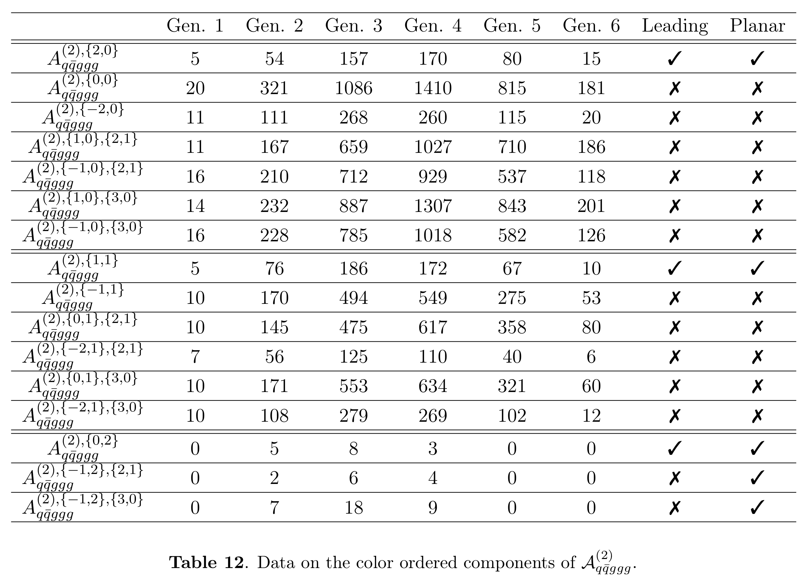
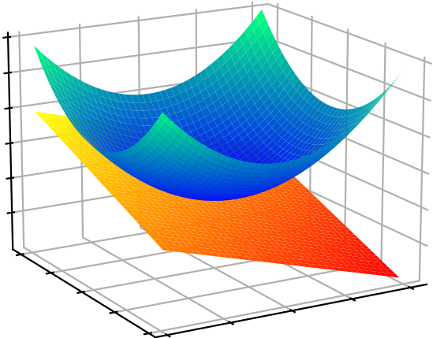



<h3 style="margin-top:5mm; margin-left: -10mm; margin-right: -10mm;">
	<b style="margin-top:15mm; font-size: 24pt;">
	   Non-Planar Two-Loop Amplitudes  
	   for Five-Parton Scattering
	</b>
</h3>

Giuseppe De Laurentis
 

 University of Edinburgh 

 
<a href="https://arxiv.org/abs/2311.10086">arXiv:2311.10086</a> 
 (GDL, H. Ita, M. Klinkert, V. Sotnikov) 

<A href="https://arxiv.org/abs/2305.17056">arXiv:2311.18752</a> 
 (GDL, H. Ita, V. Sotnikov) 

Amplitudes Meeting
 

 
  
Find these slides at  <a href="/slides/amplitudesmeeting_dec2023/#/">gdelaurentis.github.io/slides/mathemamplitudes_dec2023</a> 

---

<section>



# Introduction

---

<b style="font-variant: small-caps; font-size: xxx-large; margin-bottom: 20mm;"> Cross Sections </b>

     

          Motivations
     

     

          $\circ$ tri-jet @ $\text{NNLO}$;
     

      
     

          $\circ$ di-jet @ $\text{N}^3\text{LO}$;
     

      
     

          $\circ$ $\alpha_s$ extraction;
     

      
     

          $\circ$ collinear factorization breaking (?);
     

      
     

          $\circ$ multi-Regge kinematic limit;
     

      
     

          $\circ \; \dots$ 
     

 

     
     

     	  ATLAS Cross-Sections Summary
     

         

$$
σ_{2 \rightarrow n - 2} = \sum_{a,b} \int dx_a dx_b f_{a/h_1}(x_a, \mu_F) \, f_{b/h_2}(x_b, \mu_F) \;\hat{\sigma}_{ab\rightarrow n-2}(x_a, x_b, \mu_F, \mu_R)
$$

$$
\hat{σ}_{n}=\frac{1}{2\hat{s}}\int d\Pi_{n-2}\;(2π)^4δ^4\big(\sum_{i=1}^n p_i\big)\;|\overline{\mathcal{A}(p_i,h_i,a_i,μ_F, μ_R)}|^2
$$

---

<b style="font-variant: small-caps; font-size: xxx-large"> Color Decompositions: ''Trace'' Basis </b>

     

          \[
          \require{color}
          \require{amsmath}
          \hspace{-5mm}
          \begin{align}
               \mathcal{A}_{\vec{a}}(1_g,2_g,3_g,4_g,5_g) & = \sum_{\sigma \in \mathcal{S}_5/\mathcal{Z}_5} \sigma\Big(\text{tr}(1,2,3,4,5) \; A_{1}(1,2,3,4,5)\Big) \; + \\[2mm]
               & \quad \sum_{\sigma\in \frac{\mathcal{S}_5}{\mathcal{Z}_2 \times \mathcal{S}_3}} \sigma\Big(\text{tr}(1,2) \text{tr}(3,4,5) \; A_{2}(1,2;3,4,5)\Big) + , \\[8mm]
               \mathcal{A}_{\vec{a}}(1_u,2_{\bar u},3_g,4_g,5_g) & =
               \sum_{\sigma \in \mathcal{S}_3(3,4,5)} \sigma\Big(
               (T^{a_3}T^{a_4}T^{a_5})^{\,\bar i_2}_{i_1} \; 
               A_{3}(1,2,3,4,5)\Big) \; + \\[2mm]
               & \quad \sum_{\sigma \in \frac{\mathcal{S}_3(3,4,5)}{\mathcal{Z}_2(3,4)}} 
               \sigma\Big(\text{tr}(3,4) (T^{a_5})^{\,\bar i_2}_{i_1} 
               \; A_{4}(1,2,3,4,5)\Big) \; + \\[2mm]
               & \quad \sum_{\sigma \in \frac{\mathcal{S}_3(3,4,5)}{\mathcal{Z}_{3}(3,4,5)}} 
               \sigma\Big(\text{tr}(3,4,5) \delta^{\bar i_2}_{i_1}
               A_{5}(1,2,3,4,5)\Big) \; , \\[8mm]
               \mathcal{A}_{\vec{a}}(1_u,2_{\bar u},3_d,4_{\bar d},5_g) &= 
               \sum_{\sigma \in \mathcal{Z}_2(\{1,2\},\{3,4\})} \sigma\Big(
               \delta^{\bar i_4}_{i_1} (T^{a_6})^{\,\bar i_2}_{i_3} 
               \; A_{6}(1,2,3,4,5)\Big) \; + \\[2mm]
               & \quad \sum_{\sigma \in \mathcal{Z}_2(\{1,2\},\{3,4\})} \kern-2mm \sigma\Big(
               \delta^{\bar i_2}_{i_1} (T^{a_7})^{\,\bar i_4}_{i_3} 
               \; A_{7}(1,2,3,4,5)\Big)\,,\kern-1mm
          \end{align}
          \]
     

     
      
     
      
     

              

Each $A_{i}$ has an expansion in powers of $\alpha_s$. We consider the $\alpha_s^2$ corrections.

---

<b style="font-variant: small-caps; font-size: xxx-large">Color Decompositions:</b> <b style="font-size: xxx-large"> $N_c^{n_c}N_f^{n_f}$ </b>  <b style="font-variant: small-caps; font-size: xxx-large">Expansion</b>

Red = New; Notation = $A_{\scriptscriptstyle \\#}^{(L),(n_c, n_f)}$

     \[
     \begin{gather}
          \sim\sim\sim\sim 5g \sim\sim\sim\sim\sim
     \end{gather}
     \]

     \[
     \begin{gather}
          A_1^{(0)} = A^{(0),(0,0)} \, , \quad A_2^{(0)} = 0 \, , \qquad
          A_1^{(1)} = N_c A^{(1),(1,0)} + N_f A^{(1),(0,1)} \, , \quad A_2^{(1)} = A^{(1),(0,0)} \,,  \\[3mm]
          A_1^{(2)} = N_c^2~A_1^{(2),(2,0)} ~+~ {\color{red} {A_1^{(2),(0,0)}}} +  N_c N_fA_1^{(2),(1,1)} + N_c^{-1}N_f ~ {\color{red} {A_1^{(2),(-1,1)}}} + N_f^2 A_1^{(2),(0,2)} \,, \\[3mm]
          A_2^{(2)} = N_c {\color{red} {A_2^{(2),(1,0)}}} +~ N_f {\color{red} {A_2^{(2),(0,1)}}} ~+~ N_c^{-1}N_f^2 {\color{red} {A_2^{(2),(-1,2)}} }\,.
     \end{gather}
     \]

     \[
     \begin{gather}
          \sim\sim\sim\sim 2q3g \sim\sim\sim\sim\sim
     \end{gather}
     \]

     \[
     \hspace{-10mm}
     \begin{gather}
          A_3^{(0)} = A_3^{(0),(0,0)} \,,  \quad A_4^{(0)} = 0\,, \quad A_5^{(0)} = 0\,, \\[4mm]
          A_3^{(1)} = N_c~A_3^{(1),(1,0)} + N_c^{-1} A_3^{(1),(-1,0)} +N_f A_3^{(1),(0,1)}\,, 
               \quad A_4^{(1)} = A_4^{(1),(0,0)} +N_c^{-1}N_f A_4^{(1),(-1,1)} \,, \quad
          A_5^{(1)} = A_5^{(1),(0,0)} + N_c^{-1}N_f A_5^{(1),(-1,1)}\,, \\[4mm]
          A_3^{(2)} = N_c^2~A_3^{(2),(2,0)}+{\color{red} A_3^{(2),(0,0)}}+N_c^{-2} {\color{red} A_3^{(2),(-2,0)}}
               + N_f N_c~A_3^{(2),(1,1)} + N_c^{-1} {\color{red} A_3^{(2),(-1,1)}} + N_f^2~A_3^{(2),(0,2)}\,, \\[4mm]
          A_4^{(2)} = N_c~{\color{red} A_4^{(2),(1,0)}} + N_c^{-1} {\color{red} A_4^{(2),(-1,0)}} 
               +  N_f{\color{red} A_4^{(2),(0,1)}} + N_c^{-2}N_f {\color{red} A_4^{(2),(-2,1)}} + N_c^{-1}N_f^2 {\color{red} A_4^{(2),(-1,2)}} \\[4mm]
          A_5^{(2)} = N_c {\color{red} A_5^{(2),(1,0)}} + N_c^{-1} {\color{red} A_5^{(2),(-1,0)}} + N_f N_c{\color{red} A_5^{(2),(1,1)}} 
               + N_c^{-2}N_f {\color{red} A_5^{(2),(-2,1)}} + N_c^{-1}N_f^2 {\color{red} A_5^{(2),(-1,2)}} \,.
     \end{gather}
     \]

---

     <b style="font-variant: small-caps; font-size: xxx-large"> Relations among Partials </b>

     \[
     \begin{gather}
          \sim\sim\sim\sim \text{Known relations for } 5g \sim\sim\sim\sim\sim
     \end{gather}
     \]

     \[
     \begin{gather}
          A_1^{(2),(0,0)} = \sum_\sigma c_\sigma A_1^{(2),(2,0)}(\sigma_1,\dots,\sigma_5) + \sum_\sigma c_\sigma A_2^{(2),(1,0)}(\sigma_1,\dots,\sigma_5) \qquad \text{(schematically)}
     \end{gather}
     \]

     \[
     \begin{gather}
          \sim\sim\sim\sim 4q1g \text{ expansion} \sim\sim\sim\sim\sim
     \end{gather}
     \]

     \[
     \begin{gather}
          A_6^{(0)} = A_6^{(0),(0,0)} \,, \quad A_7^{(0)} = \frac{1}{N_c} A_7^{(0),(-1,0)} \,, \\
          A_6^{(1)} = N_c A_6^{(1),(1,0)} + \frac{1}{N_c} A_6^{(1),(-1,0)} + N_f A_6^{(1),(0,1)} \,,\quad 
          A_7^{(1)} = A_7^{(1),(0,0)} + \frac{1}{N_c^2} A_7^{(1),(-2,0)} + \frac{N_f}{N_c} A_7^{(1),(-1,1)} \,, \\[2mm]
          A_6^{(2)} = N_c^2 A_6^{(2),(2,0)} + {\color{red} A_6^{(2),(0,0)}} + \frac{1}{N_c^2} {\color{red} A_6^{(2),(-2,0)}}
               +  N_f N_c A_6^{(2),(1,1)} + \frac{N_f}{N_c} {\color{red} A_6^{(2),(-1,1)}} + N_f^2  A_6^{(2),(0,2)} \\
          A_7^{(2)} = N_c {\color{red} A_7^{(2),(1,0)}}+\frac{1}{N_c}{\color{red} A_7^{(2),(-1,0)}}+\frac{1}{N_c^3}{\color{red} A_7^{(2),(-3,0)}}
               + N_f{\color{red} A_7^{(2),(0,1)}} + \frac{N_f}{N_c^2} {\color{red} A_7^{(2),(-2,1)}} + \frac{N_f^2}{N_c}{\color{red} A_7^{(2),(-1,2)}}\,.
     \end{gather}
     \]

     \[
     \begin{gather}
          \sim\sim\sim\sim \text{New relations for } 4q1g \text{ (technically for the remainders)} \sim\sim\sim\sim\sim
     \end{gather}
     \]

     \[
     \Big\{ \big[ 16 \, A^{(2),(2,0)}_6\, (1,2,3,4,5) 
          + 4 \, A^{(2),(0,0)}_6\, (1,2,3,4,5) + 
          A^{(2),(-2,0)}_6(1,2,3,4,5) \big]
          - \big[\dots \big]_{3 \leftrightarrow 4} \Big\}
          - \Big\{ \dots \Big\}_{1 \leftrightarrow 2} = 0 \, .
     \]

     \[
     \begin{gather}
          \big[  32 \, A^{(2),(2,0)}_6\, (1,2,3,4,5) + 8 \, A^{(2),(0,0)}_6\, (1,2,3,4,5) + 2 A^{(2),(-2,0)}_6(1,2,3,4,5) \\
               + 16 \, A^{(2),(1,0)}_7\, (1,2,3,4,5) \, + 4 A^{(2),(-1,0)}_7(1,2,3,4,5) + A^{(2),(-3,0)}_7 (1,2,3,4,5) \big]
               - \big[ \dots \big]_{3 \leftrightarrow 4}=  0 \, .
     \end{gather}
     \]

Plus two more for the $N_f^1$ partials.

---

     <b style="font-variant: small-caps; font-size: xxx-large"> Number of Cut Diagrams </b>

---

<b style="font-variant: small-caps; font-size: xxx-large"> Partial Amplitudes </b>
 

     $\circ$ Amplitude (integrands) can be written as (drop the extra sub- and super-scripts)

 

     $$
     \displaystyle A(\lambda, \tilde\lambda, \ell) =
\sum_{\substack{\Gamma,\\ i \in M_\Gamma \cup S_\Gamma}} \, c_{\,\Gamma,i}(\lambda, \tilde\lambda, \epsilon) \,		\frac{m_{\Gamma,i}(\lambda\tilde\lambda, \ell)}{\textstyle \prod_{j} \rho_{\,\Gamma,j}(\lambda\tilde\lambda, \ell)} \;\; \xrightarrow[]{\int d^D\ell} \;\; \sum_{\substack{\Gamma,\\ i \in M_\Gamma}} {\color{red}c_{\,\Gamma, i}}(\lambda, \tilde\lambda, \epsilon) \, {\color{orange}I_{\Gamma, i}}(\lambda\tilde\lambda, \epsilon)
$$  

 

     $\circ$ For a suitable choice of integrands, we get:

 

     $$
     \displaystyle
     {\color{red}c_{\Gamma, i}}(\lambda, \tilde\lambda, \epsilon) = \frac{ \sum_{k=0}^{\text{finite}} \, {\color{red}c^{(k)}_{\,\Gamma, i}}(\lambda, \tilde\lambda) \, \epsilon^k}{\prod_j (\epsilon - a_{ij})} \;, \;\;\text{with} \quad a_{ij} \in \mathbb{Q} \, . 
     $$

 

     Some notation:

 

     $\circ$  $\Gamma$: topologies $\quad\circ$ $M_\Gamma$: masters $\quad\circ$ $S_\Gamma$: surface terms

     $\circ$ Spinors: $\lambda_i = |i\rangle, \tilde\lambda_i =[i|$
     $\quad\circ$ 4-momenta: $\lambda\tilde\lambda=p\kern-3mm/$
     $\quad\circ$ Loop $D$-momenta: $\ell $

</section>

---

<section>



<h1 style="margin-top: -2mm;"> Numerical Computation </h1>

---

<b style="font-variant: small-caps; font-size: xxx-large"> Numerical Generalized Unitarity </b>
 
<a style="font-size: large; text-align: center; float: center; margin-right: 0mm; margin-top: 0mm; margin-bottom: 0mm;" href=https://arxiv.org/abs/1510.05626>
     Ita ('15)
</a>
<a style="font-size: large; text-align: center; float: center; margin-left:2mm; margin-right: 0mm; margin-top: 0mm; margin-bottom: 0mm;" href=https://arxiv.org/abs/1712.03946>
     Abreu, Febres Cordero, Ita, Page, Zeng ('17)
</a>

$\circ$ We have an Ansatz for the loop integrand

 

$$
\require{color}
\displaystyle A(\lambda, \tilde\lambda, \ell) = \sum_{\Gamma} \, \sum_{i \in M_\Gamma \cup S_\Gamma} \, c_{\,\Gamma,i}(\lambda, \tilde\lambda) \, \frac{m_{\Gamma,i}(\lambda\tilde\lambda, \ell)}{\textstyle \prod_{j} \rho_{\,\Gamma,j}(\lambda\tilde\lambda, \ell)}
$$

$\circ$ Generalized unitarity relates cuts of loop amplitudes to products of trees

     

	     $$
	     \require{color}
	     \displaystyle \sum_{\text{states}} \, \prod_{\text{trees}} A^{\text{tree}}(\lambda, \tilde\lambda, \ell)\big|_{\text{cut}_{\Gamma}} = \sum_{\substack{\Gamma' \ge \Gamma, \\ i \in M_\Gamma' \cup S_\Gamma'}} \kern-2mm c_{\,\Gamma',i}(\lambda, \tilde\lambda) \, \frac{m_{\Gamma',i}(\lambda\tilde\lambda, \ell)}{\displaystyle \prod_{j\in P_{\Gamma'} / P_{\Gamma}} \rho_{j}(\lambda\tilde\lambda, \ell)}\Bigg|_{\text{cut}_\Gamma}
	     $$
	

     

	     

	     	  <code> C++ code </code>
	     
 
	     
	      
	     <a style="font-size: large; text-align: center; float: center; margin-top: -10mm; margin-bottom: 5mm;"
	     	href=https://arxiv.org/abs/2009.11957>
		
 Abreu, Dormans, 

		
 Febres Cordero, Ita  

		
 Kraus, Page, Pascual, 

		
 Ruf, Sotnikov ('20) 

	     </a>
	

     

	     Numerical Berends-Giele recursion for LHS, solve for coeffs. in RHS.
	

     

	     Perhaps show Box and Triangle example from <a style="font-size: x-large; text-align: center; float: center; margin-left:0mm; margin-right: 0mm; margin-top: 0mm; margin-bottom: 0mm;" href=https://inspirehep.net/files/c6d8446cc3361241b632616f3da7b735#page=63>
               my PhD thesis page 63
          </a>
	

---

<b style="font-variant: small-caps; font-size: xxx-large"> Integration By Parts Reduction </b>

     $\circ$ Master / surface decomposition for non-planar topologies

$$
\require{color}
\begin{align}
\kern-25mm \text{IBP-generating vectors: } & \quad \displaystyle \int d^D \ell \frac{\partial }{\partial \ell^\mu_a} \frac{v^\mu_a(\ell)}{\rho_1 \dots \rho_N} = 0 \quad (\text{in dim. reg.}) \\[2mm]
\kern-25mm \text{No propagator doubling: } & \quad \displaystyle \sum_{a, \mu} v^\mu_a(\ell) \frac{\partial \rho_i}{\partial \ell^\mu_a} - f_i(\ell)\rho_i = 0
\end{align}
$$

     $(v^\mu_a, f_i)$ form a <i>syzygy module</i>, solved for in <i>embedding space</i> using <code>Singular</code> + linear algebra.

     $\circ$ Semi-numerical surface terms: $\quad m_{i\in S_\Gamma}(\ell \leftarrow \text{analytical}, s_{ij} \leftarrow \text{numerical})$

     $\kern20mm\star$ dependance on external kinematics ($s_{ij}$) obtained from sparse linear systems.

 

     $\circ$ Little group information retained throughout the computation

     $\kern20mm\star$ genuine $c_{\Gamma,i}(\lambda, \tilde\lambda)$ instead of $c_{\Gamma,i}(\lambda\tilde\lambda)$ + conventions for the polarization states.

---

<b style="font-variant: small-caps; font-size: xxx-large"> Finite Remainders </b>

<!---

Decomposition in terms of <b> master integrals </b> 

<a style="font-size: large; text-align: right; float: right; margin-bottom: 5mm; margin-top: 10mm" href=https://arxiv.org/abs/0712.1851>Ellis, Zanderighi</a>
<a style="font-size: large; text-align: right; float: right; margin-bottom: 5mm; margin-top: 10mm" href=https://arxiv.org/abs/hep-ph/9212308>Bern, Dixon, Kosower;&nbsp</a>
<a style="font-size: large; text-align: right; float: right; margin-bottom: 5mm; margin-top: 10mm" href=https://www.sciencedirect.com/science/article/pii/0550321379906059?ref=pdf_download&fr=RR-2&rr=7c4afcac1f343b58>'t Hooft, Veltman;&nbsp</a>

$$A^{1-\text{loop},D=4}_{n} = \sum_i \color{orange}{d_i} \color{red}{I^i_{Box}} + \sum_i \color{orange}{c_i} \color{red}{I^i_{Triangle}} + \sum_i \color{orange}{b_i} \color{red}{I^i_{Bubble}} + \sum_i \color{orange}{a_i} \color{red}{I^i_{Tadpoles}} + \color{orange}{R}$$

       

--->

     $\circ$ Dim-reg is great, but it also introduces <b>a lot</b> of junk (see next slide).

     $\circ$ <u>All physical information</u> is contained in the <i>finite remainder</i>, at two loops

$$ 
\underbrace{\mathcal{R}^{(2)}}_{\text{finite remainder}} = \mathcal{A}^{(2)}_R \underbrace{- \quad I^{(1)}\mathcal{A}^{(1)}_R \quad - \quad I^{(2)}\mathcal{A}^{(0)}_R}_{\text{divergent + convention-dependent finite part}} + \mathcal{O}(\epsilon)
$$

     $\phantom{\circ}$ $\mathcal{A}^{(1)}_R$ to order $\epsilon^2$ is still needed to build $\mathcal{R}^{(2)}$, but there is no reason to reconstruct it

     Although by the time I learned this, I had already reconstructed $\mathcal{A}^{(1)}_{5g}$ to $\epsilon^2$ $\qquad$

 

     $\circ$ Finite remainder as a weighted sum of <i>pentagon functions</i> <a style="font-size: large; display: inline-block; text-align: right; float: right; margin-top: 2mm; margin-left: 4mm; " href=https://arxiv.org/abs/2009.07803> Chicherin, Sotnikov ('20);&nbsp; </a>

$$ 
\textstyle \mathcal{R}(\lambda, \tilde\lambda) = \sum_i \color{orange}{r_{i}(\lambda,\tilde\lambda)} \, \color{red}{h_i(\lambda\tilde\lambda)}
$$

    Goal: Reconstruct $\color{orange}{r_{i}(\lambda,\tilde\lambda)}$ from $\mathbb{F}_p$ samples

<a style="font-size: large; text-align: right; float: right; margin-top: 0mm; margin-bottom: -10mm;" href=https://arxiv.org/abs/1406.4513>
von Manteuffel, Schabinger ('14)
</a> 
<a style="font-size: large; text-align: right; float: right; margin-top: -10mm; margin-bottom: 0mm;" href=https://arxiv.org/abs/1608.01902>
Peraro ('16)
</a>

     $\circ$ More precisely, we would like a basis of the vector space $\text{span}(r_i(\lambda,\tilde\lambda))$  
     $\phantom{\circ}$ (given a basis, obtaining the full set is easy).

---

<b style="font-variant: small-caps; font-size: xxx-large; margin-bottom: -10mm;"> Number of Indep. Functions w/o Subtraction </b>

---

<b style="font-variant: small-caps; font-size: xxx-large;"> Memoization </b>

     $\circ$ Why? Evaluations cost up to 1-2 hours, per phase space point, per partial amplitude!  
     $\phantom{\circ}$ And I need up to ~35k points per partial. (Less for the quark channels, see later.)

     $\circ$ Pseudo-random squences of phase-space points over finite fields generated using <a href=https://github.com/GDeLaurentis/lips> lips </a>

     $\circ$ Custom (for now private) interface to <code>Caravel</code> with:  
     $\quad \star$ caching to a SQLite database using <a href=https://pypi.org/project/diskcache> diskcache </a> via Python decorators,  
     $\quad \star$ and facilities for distributed computing into a slurm cluster.

</section>

---

<section >



    

# Analytic and Geometric Structure

    

based on:  
[GDL, Page (JHEP 12 (2022) 140)](https://arxiv.org/abs/2203.04269)  
GDL, Ita, Page, Sotnikov (to appear)

---

<b style="font-variant: small-caps; font-size: xxx-large;"> Polynomial Quotient Rings  </b>

     $\circ$ Let us start from the polynomial ring of spinor components

 

     $$\displaystyle \kern-50mm S_n = \mathbb{F}\left[|1⟩, [1|, \dots, |n⟩, [n|\right]$$

 

     $\phantom{\circ}$ the field $\mathbb{F}$ can be any of $\mathbb{Q},\mathbb{R},\mathbb{C},\mathbb{F}_p,\mathbb{Q}_p,\dots$

 

     $\circ$ Define the momentum-conservation ideal as

     $$
     \displaystyle J_{\Lambda_n} = \Big\langle \sum_i |i⟩[i| \Big\rangle_{S_n}
     $$

     
      
     

     	  Artist's Impression of $V(J_{\Lambda_n})$   I can't draw in $4n$ dims!
     

 

     $\phantom{\circ}$ physically, two polynomials $p$ and $q$ are equivalent if $p-q\in J_{\Lambda_n}$

 

     $\circ$ This defines the needed polynomial <b>quotient</b> ring$\kern-4mm\phantom{x}^{\star}$: $\;R_n = S_n / J_{\Lambda_n} $

    $r_i(\lambda, \tilde\lambda)$ at $n$-point belong to the Field of Fractions$\kern-4mm\phantom{x}^{\dagger}$ of $R_n$

     $\kern-4mm\phantom{x}^\star R_4$ is "weird" (not a UFD), but it proves that polynomial rings are insufficient;
     $\;\kern-4mm\phantom{x}^\dagger$ The field of fractions of $R_3$ does not exist.

---

<b style="font-variant: small-caps; font-size: xxx-large"> Prime Ideals \& Irreducible Varieties  </b>

     $\circ$ Let us consider a very simple example (at 4-point)

 

     $\displaystyle \kern-50mm iA_{g^-g^-g^+g^+}^{\text{tree}} = \frac{\langle 12 \rangle^3}{\langle 23 \rangle \langle 34 \rangle \langle 41 \rangle} = \frac{[34]^3}{[12][23][41]} $

 

     $\phantom{\circ}$ is, say, $\langle 23 \rangle$ a pole of this amplitude?

     
      
     

     	  Artist's Impression of $V(\big\langle \langle 23 \rangle\big\rangle_{R_4})$  
	  as the union of two irreducibles
     

 

     $\circ$ The question is ill posed!

     $\phantom{\circ} \langle 23 \rangle$ does not identify an irreducible variety in $R_4$.

     $\phantom{\circ}$ Compute $\color{green}\text{primary decompositions}$, such as

     $\displaystyle \big\langle \langle 23\rangle \big\rangle_{R_4} = {\color{orange} \big\langle \langle 23\rangle, [14] \big\rangle_{R_4}} \cap {\color{blue} \big\langle \langle 12\rangle, \langle 13 \rangle, \langle 14\rangle, \langle 23\rangle, \langle 24 \rangle, \langle 34 \rangle \big\rangle_{R_4}} $

 

     $\phantom{\circ}$ On the <b style="color: orange"> first branch </b> there is a simple pole, on the <b style="color: blue"> latter branch </b> the amplitude is regular.

    Poles & Zeros $\;\Leftrightarrow\;$ Irreducible Varieties $\;\Leftrightarrow\;$ Prime Ideals  
    <i style="font-size: 12pt; border-top: -8mm; border-bottom: -2mm;"> Physics $\kern38mm$ Geometry $\kern38mm$ Algebra </i>

---

<b style="font-variant: small-caps; font-size: xxx-large"> Five-Point Kinematics </b>

     $\circ\,$ The rational coefficients take the form

 

     $$
     \displaystyle r_i(|i\rangle,[i|) = \frac{\text{Num. poly}(|i\rangle,[i|)}{\text{Denom. poly}(|i\rangle,[i|)} = \frac{\mathcal{N}(|i\rangle,[i|)}{\prod_j D_j^{q_{ij}}(|i\rangle,[i|)}
     $$

     $\circ\,$ The denominator factors $\mathcal{D}_j$ are conjectured to be restricted to the letters of the symbol alphabet

<a style="font-size: large; text-align: right; float: right; margin-top: 0mm; margin-bottom: 0mm;" href=https://arxiv.org/abs/1812.04586>
   Abreu, Dormans, Febres Cordero, Ita, Page ('18)
</a>
 

     $$
     \displaystyle \{\mathcal{D}_{\{1,\dots,35\}}\} = \bigcup_{\sigma \; \in \; \text{Aut}(R_5)} \sigma \circ \big\{ \langle 12 \rangle, \langle 1|2+3|1] \big\} \, , \qquad \text{Aut}(R_5) = \mathcal{P} \times \mathcal{S}_5
     $$

     $\qquad\color{green}\text{Identical to 1-loop!}$

     $\phantom{\circ}$ Non-trivial statement (not proven!): all irreducible polynomials generate prime ideals, @ 5-pt.

 

     $\circ\,$ Advantage of spinor variables:

 

     $1.$ little group covariant LCD (no spurious poles); $\;\;2.$ avoiding parity even/odd split.  
     $\Rightarrow\;$ fewer and simpler functions to reconstruct compared to Mandelstams or Twistors.

     Next we obtain the denomiantor exponents $q_{ij}$.

---

<b style="font-variant: small-caps; font-size: xxx-large"> Least Common Denominator </b>

     $\circ\,$ The exponents $q_{ij}$ are given by

 

     $$
     \displaystyle \ln\left(\lim_{\mathcal{D}_j \rightarrow 0} r_i\right) = \underbrace{\ln(\mathcal{O}(1) \text{ const.})}_{|\dots |\ll | \ln \mathcal{D}_j |}- q_{ij} \ln \mathcal{D}_j
     $$

     $\circ\,$ Issue: this can be done for $\mathbb{R}$, $\mathbb{C}$, $\mathbb{Q}_p$ but <u>not</u> $\mathbb{F}_p$ .

     $\circ\,$ Solution: univariate Thiele rational interpolation on a line going through $V(\langle \mathcal{D}_j \rangle)$

 

     $$
     \displaystyle |i\rangle \rightarrow |i\rangle (t)  |i\rangle + t c_i |\eta\rangle ,  \qquad |i] \rightarrow |i] \, , \qquad
     \text{s.t.} \quad \sum_i c_i |i] = 0
     $$

     $\circ\,$ After interpolation on the (anti-)holomorphic slice, the rational functions read

 

     $$
     \displaystyle r_i(t) = \frac{\text{Poly. }(t)}{\prod_j (t-t_{\mathcal{D}_j})^{q_{ij}}}
     $$

     where $t_{\mathcal{D}_j}$ is simply the solution to $D_j(t) = 0$. We read off the $q_{ij}$.

---

<b style="font-variant: small-caps; font-size: xxx-large"> Complexity of the Reconstruction </b>

     $\circ\,$ Sort the $r_i$ by mass dimension of $\mathcal{N}$ ($\approx$ Ansatz size), pick simplest subset forming a basis $r_{i \in \mathcal{B}}$

</section>

---

<section>



# Analytic Reconstruction

---

<b style="font-variant: small-caps; font-size: xxx-large"> Picking a Basis </b>

     $\circ\,$ We currently have:

 

     $$
     R = r_{i\in \mathcal{B}} M_{ij} h_j
     $$

     $\circ\,$ Basic idea: change basis from a subset of pentagon function coefficients, to linear combinations

 

     $$
     \tilde{r}_{i'} = O_{i'i} \, r_{i \in \mathcal{B}} \quad \text{s.t.} \quad \text{rank}(O_{i'i}) = \text{dim(span)}(r_{i})
     $$

     $\circ\,$ Key insight: 

 

     $$
     \text{dim(span)}\left(\lim_{\mathcal{D_j} \rightarrow  0 }r_{i}\right) \leq \text{dim(span)}(r_{i})
     $$

     In other words, the pole residues are correlated, so we can build linear combinations that ''remove the overlap''

---

<b style="font-variant: small-caps; font-size: xxx-large"> Correlation of Residues </b>

     $\circ\,$ Collect several (anti-)holomorphic slices, build Laurent expansions around $t_{\mathcal{D}_k}$

 

     $$
     r_{i \in \mathcal{B}} = \sum_{m = 1}^{q_k} \frac{e^k_{im}}{(t-t_{\mathcal{D}_k})^m} + \mathcal{O}((t-t_{\mathcal{D}_k})^0)
     $$

---

<b style="font-variant: small-caps; font-size: xxx-large"> Breadth-First Search </b>

Intersection of the null-spaces = linear combination that removes a singularity

---

<b style="font-variant: small-caps; font-size: xxx-large"> Least Least-Common-Denominator </b>
 

     $\circ$ In other words, the $\tilde{c}$ span a vector space, and we should $\color{green}\text{consider one modulo the others}$

$\displaystyle \tilde{c}_i = \sum_{j\neq i} q_j \tilde{c}_j + \tilde{c}'_{i}$

     $\phantom{\circ}$ the basis function $\tilde{c}_i$ can be replaced by $\tilde{c}'_i$ <u>without changing the vector space</u>.

     $\circ$ In particular, $\tilde{c}'_i$ needs not have all the poles of $\tilde{c}_i$, thus it can be much simpler.
       $\phantom{\circ}$ In other words, $\color{red}\text{the LCD of }\tilde{c}'_i\text{ can be smaller than that of }\tilde{c}_i$.

     $\circ$ Brute-force search works well when an analytic expressions is available.

     $\circ$ In a future publication we will provide an algorithm based on finite field evaluations.

    Reconstructing a set of $c_i$ is not as bad as reconstructing the most complex function in the set.

---

<b style="font-variant: small-caps; font-size: xxx-large"> The Numerator Ansatz </b>

$\circ\,$ The numerator Ansatz takes the form

<a style="font-size: large; text-align: right; float: right; margin-top: -6mm; margin-bottom: 4mm;" href=https://arxiv.org/abs/1904.04067>
   GDL, Maître ('19)
</a>

$\displaystyle \text{Num. poly}(\lambda, \tilde\lambda) = \sum_{\vec \alpha, \vec \beta} c_{(\vec\alpha,\vec\beta)} \prod_{j=1}^n\prod_{i=1}^{j-1} \langle ij\rangle^{\alpha_{ij}} [ij]^{\beta_{ij}}$

     $\phantom{\circ}$ subject to constraints on $\vec\alpha,\vec\beta$ due to: 1) mass dimension; 2) little group; 3) linear independence.

 

$\circ\,$ Construct the Ansatz via the algorithm from Section 2.2 of <a href=https://arxiv.org/abs/2203.04269>GDL, Page ('22)</a>

Linear independence = irreducibility by the Gröbner basis of a specific ideal.

<!---

$
\begin{align}
	\textstyle \sum_{j=1}^n\sum_{i=1}^{j-1} (\alpha_{ij} + \beta_{ij}) & = d \quad \text{: mass dimension} \\[2mm]
	\textstyle \sum_{j=1}^n\sum_{i=1}^{j-1} \alpha_{ij}\underbrace{\{\langle ij \rangle\}_k}_{\delta_{ik}+\delta_{jk}} + \beta_{ij}\underbrace{\{[ij]\}_k}_{-\delta_{ik}-\delta_{jk}} & = \phi_k \quad \text{: k}^{th}\text{ little group weight}
\end{align}
$

--->

$\circ\,$ Efficient implementation using open-source software only

     <!---
	

	     
 <code> Lips </code> 

	     
 Spinor ideal 

	     <a style="font-size: large; text-align: center; float: center; margin-top: 0mm; margin-bottom: 5mm;"
	     href=https://arxiv.org/abs/2305.14075>
		GDL ('23)
	     </a>	    
	

    --->
	

	       
	     Gröbner bases $\rightarrow$ constrain $\vec\alpha,\vec\beta$  
	     <a style="font-size: large; text-align: center; float: center; margin-top: -10mm; margin-bottom: 5mm;"
	     href=https://www.singular.uni-kl.de/index.php.html>
		Decker, Greuel, Pfister, Schönemann
	     </a>	    
	

	

	       
	     Integer programming $\rightarrow$ enumerate sols. $\vec\alpha,\vec\beta$  
	     <a style="font-size: large; text-align: center; float: center; margin-top: -10mm; margin-bottom: 5mm;"
	     href=https://www.singular.uni-kl.de/index.php.html>
		Perron and Furnon (Google optimization team)
	     </a>
	

    

$\circ\,$ All linear systems solved with CUDA over $\mathbb{F}_{p\leq 2^{31}-1}$ on a laptop ($t_{\text{solving}} \ll t_{\text{sampling}}$)

---

<b style="font-variant: small-caps; font-size: xxx-large"> A Basis of the Vector Space </b>
 

https://arxiv.org/pdf/2311.10086.pdf#page=14

     $\circ$ The set $c_i$ can be very large, so pick a set of independent ones, and write:

     $\displaystyle c_i = \tilde{c}_j M_{ji} \quad \text{with} \quad M_{ji} \in \mathbb{Q}$ 

     $\phantom{\circ}$ with $\tilde{c}$ an independent subset of $c$.  
     $\phantom{\circ}\Longrightarrow$ $M_{ji}$ is, up to a permutation of columns, in row reduced echelon form.

     $\circ$ We might as well use a set $\tilde{c}$ which is not a subset of $c$, at the trivial cost of changing $M_{ji}$.

     $\circ$ Consider a PFD of one of the $\tilde{c}$'s:

    $\displaystyle \tilde{c}_i(\lambda,\tilde\lambda) = \frac{\mathcal{N}_i(\lambda,\tilde\lambda)}{\prod_j W_j^{q_{ij}}(\lambda,\tilde\lambda)} = \sum_k \frac{\mathcal{N}_{ik}(\lambda,\tilde\lambda)}{\prod_j W_j^{q_{ijk}}(\lambda,\tilde\lambda)} = \sum_k \tilde{c}_{ik}(\lambda,\tilde\lambda)$

     We $\color{red}\text{cannot have } \tilde{c}_i \in \text{span}(\tilde{c}_{j\neq i})$, but we $\color{green} \text{can have }\tilde{c}_{ik} \in \text{span}(\tilde{c}_{j\neq i})$, for some, but not all, $k$.

</section>

---

<section>



# Outlook

---

<b style="font-variant: small-caps; font-size: xxx-large; margin-bottom: 5mm;">
  W+2-jets: simplification strategy
</b>

     $0.\,$ Start from analytics of <a style="font-size: large"; href="https://arxiv.org/abs/2110.07541">Abreu, Febres Cordero, Ita, Klinkert, Page, Sotnikov ('21) </a> - 1.2GB of <code>C++</code> source code.

     $1.\,$ Script to split up the expressions, and compile them ($\sim 20$GB binaries) for evaluation over $\mathbb{F}_p$;

$2.\,$ Recombine the 3 projections $p_V \parallel p_1, p_V \parallel p_2, p_V \parallel p_3$ and reintroduce the little group factors   
to build 6-point spinor-helicity amplitudes (subject to degree bounds on $|5\rangle,[5|,|6\rangle,[6|$);  

$3.\,$ Perform (rough) PFDs based on expected structures and fit the Ansatze.

 

Comparison of $q\bar q \rightarrow \gamma \gamma \gamma$ (in full color) to $pp \rightarrow Wjj$ (at leading color):   

<table width=110% border="1" cellspacing="0" cellpadding="0" style="margin-left: -12mm; margin-bottom: 8mm; margin-top: 8mm; font-size: x-large;">
  <tr>
    <td><b>Kinematics</b></td>
    <td><b># Poles ($W$)</b></td>
    <td><b>LCD Ansatz</b></td>
    <td><b>Partial-Fraction Ansatz</b></td>
    <td><b>Rational Functions</b></td>
  </tr>
  <tr>
    <td style="text-align: center;">5-point massless</td>
    <td style="text-align: center;">35</td>
    <td style="text-align: center;">29k</td>
    <td style="text-align: center;">4k</td>
    <td style="text-align: center;">$\sim$300 KB</td>
  </tr>
  <tr>
    <td style="text-align: center;">5-point 1-mass</td>
    <td style="text-align: center;">>200</td>
    <td style="text-align: center;">>5M</td>
    <td style="text-align: center;">$\sim$40k</td>
    <td style="text-align: center; background-color: yellow;">$\sim$25 MB</td>
  </tr>
</table>

     $\displaystyle \kern-10mm \{W_j\} = \bigcup_{\sigma \; \in \; \text{Aut}(R_6)} \sigma \circ \big\{ \langle 12 \rangle, \langle 1|2+3|1], \langle 1|2+3|4], s_{123}, \Delta_{12|34|56}, ⟨3|2|5+6|4|3]-⟨2|1|5+6|4|2] \big\} $

---

<b style="font-variant: small-caps; font-size: xx-large; margin-bottom: 10mm;">
   Analytic Structures of 2-loop 5-point 1-mass Amplitudes
</b>

     

          $\circ$ The  Ansatz size grows quickly with   multiplicity (m) and mass dimension (d):   
          $\displaystyle \small \left(\mkern -9mu \begin{pmatrix}\, m(m-3)/2 \, \\ \, d/2 \, \end{pmatrix} \mkern -9mu \right)$   
          is a lower bound. <a style="font-size: large; display: inline-block; text-align: right; float: right; margin-left: -28mm; margin-top: 1mm; margin-bottom: 5mm;" href=https://arxiv.org/abs/2010.14525>
               GDL, Maître ('20)
          </a>
     

     

          
     

$\circ\,$ Compact residues for the new 2-loop (spurious?) pole, $⟨k|j|p\mkern-7.5mu/_V|l|k]-⟨j|i|p\mkern-7.5mu/_V|l|j]$, e.g.:
$$r^{(5 \text{ of } 54)}_{\bar{u}^+g^+g^+d^-(V\rightarrow \ell^+ \ell^-)} = \frac{[12][23]⟨24⟩⟨46⟩^2⟨1|2+3|4]⟨2|1+3|4]}{⟨12⟩⟨23⟩⟨56⟩(⟨3|2|5+6|4|3]-⟨2|1|5+6|4|2])^2}$$

$\circ\,$ The three mass Grams, $\Delta_{12|34|p_V}, \Delta_{14|23|p_V}$, behave analogously to one-loop amplitudes, e.g.:

$$ r^{(73 \text{ of } 120)}_{\bar{u}^+g^-g^+d^-(V\rightarrow \ell^+ \ell^-)} = \frac{105}{128}\frac{⟨2|1+4|3]⟨4|2+3|1]⟨6|1+4|5]s_{14}s_{23}s_{56}{\color{green}(s_{124}-s_{134})}(s_{123}-s_{234})(s_{25}+s_{26}+s_{35}+s_{36})}{{\color{orange}⟨3|1+4|2]}{\color{red}Δ_{23|14|56}^4}} + \\
\Bigg[-6\frac{[12]^2⟨13⟩[25]⟨34⟩⟨36⟩⟨56⟩[56]{\color{green}(s_{124}-s_{134})}}{{\color{orange}⟨3|1+4|2]^5}}\Bigg] + \Bigg[ \; \Bigg]_{1234\rightarrow \overline{4321}}+ \mathcal{O}\left(\frac{1}{⟨3|1+4|2]^{4}Δ_{23|14|56}^{3}}\right)$$

</section>

---

<section>

<!---
<b style="font-variant: small-caps; font-size: xxx-large; margin-bottom: 10mm;">
   Conclusions
</b>

     $\circ\,$ Full-color 5-point massless amplitudes are well within reach, 

     $\circ\,$ Subleading color corrections can be fairly sizable

     $\circ\,$ The reconstruction can be peformed in spinor-helicity variables, which yield compact results

     $\circ\,$ Understanding the partial fraction structure of amplitudes is essential to tame their complexity

---
--->

<b style="font-variant: small-caps; font-size: xxx-large;"> Thank you   for your attention! </b>
 
 
<!---
<b style="font-variant: small-caps; font-size: xx-large;"> Questions? </b>
--->

    These slides are powered by: 
    
        <a href="https://en.wikipedia.org/wiki/Markdown">markdown</a>, 
        <a href="https://en.wikipedia.org/wiki/HTML">html</a>, 
        <a href="https://revealjs.com/">revealjs</a>, 
        <a href="https://gohugo.io/">hugo</a>, 
        <a href="https://www.mathjax.org/">mathjax</a>, 
        <a href="https://github.com/">github</a>
    

<!---
 

     For open source packages: 
     <code>
          $   $ pip install [lips](https://github.com/GDeLaurentis/lips) [pyadic](https://github.com/GDeLaurentis/pyadic)
     </code>

--->

</section>

---

<section>

# Backup Slides

---

<b style="font-variant: small-caps; font-size: xxx-large; margin-bottom: -5mm;"> Constraints from Poles </b>
 
<b style="font-variant: small-caps; font-size: x-large; margin-top: -16mm;"> Bootstrapping trees (?) </b>

     $\circ$ The degree of divergence / vanishing on various surfaces imposes strong constraints, e.g.

     $ A^{\text{tree}}_{q^+g^+g^+\bar q^-g^-g^-} = \frac{\mathcal{N(\text{m.d.} = 6\,,\; \text{p.w.} = [-1, 0, 0, 1, 0, 0])}}{\langle 12\rangle\langle 23\rangle\langle 34\rangle [45][56][61]s_{345}}$

     $\circ$ Pretend this is un unknown integral coefficient, $\mathcal{N}$ has 143 free parameters.

     $\circ$ List the various prime ideal, such as

   

     $ \big\langle \langle 12\rangle, \langle 23\rangle, \langle 13\rangle \big\rangle, \; \big\langle |1\rangle \big\rangle, \; \big\langle \langle 12\rangle, |1+2|3]\big\rangle, \dots$

     $\phantom{\circ}$ and impose that $\mathcal{N}$ vanishes to the correct order. We determine it up to an overall constant.

<a style="font-size: large; text-align: right; float: right; margin-top: -2mm; margin-bottom: 0mm;" href=https://arxiv.org/abs/2207.10125>
     GDL, Page ('22)
</a>

     $\circ$ Likewise, the ansatz for $A^{\text{tree}}_{g^+g^+g^+ g^-g^-g^-}$ shrinks $1326 \rightarrow 1$, etc..

   

     <i> Effectively, we can <b> compute </b> trees, just from their <u>poles orders</u>.   Note: compared to BCFW there is <u>no</u> information about <u>residues</u>. </i>

---

<b style="font-variant: small-caps; font-size: xxx-large"> Partial Fraction Decompositions </b>

     $\circ$ For true integral coefficients, we can't rely on the Ansatz to shrinks to an overall constant.

     $\circ$ Partial fraction decompositions (PFDs) are a popular method to tame algebraic complexity.

     $\circ$ In my opinion, a PFD algorithm needs

   

     $1.$ to say if two poles $W_a$ and $W_b$ are separable into different fractions;  
     $2.$ ideally, to answer $(1.)$ without having access to an analytic expression. 

     $\circ$ Hilbert's nullstellensatz: if $\mathcal{N}$ vanishes on all branches of $\langle W_a, W_b \rangle$, then the PFD is possible$\kern-3mm\phantom{x}^\dagger$.

     $\circ$ Generalizing to powers $>\kern-1mm 1$ can be done via symbolic powers and the Zariski-Nagata Theorem.

<a style="font-size: large; text-align: right; float: right; margin-top: 1mm; margin-bottom: 0mm;" href=https://arxiv.org/abs/.>
   GDL, Page ('22)
</a>

     $\circ$ Similarly, generalizing to non-radical ideals requires ring extensions.

<a style="font-size: large; text-align: right; float: right; margin-top: 0mm; margin-bottom: 0mm; margin-right: 33mm;" href=https://arxiv.org/abs/.>
   Campbell, GDL, Ellis ('22)
</a>

     <b> Issue: </b>evaluations on singular surfaces are expensive, but are not always needed!

     <b> Opportunity: </b>we get more than partial fraction decompositions.

      

     $\kern-4mm\phantom{x}^\dagger$ $\langle W_a, W_b\rangle$ needs to be radical.

---

<b style="font-variant: small-caps; font-size: xxx-large"> Beyond Partial Fractions </b>

     $\circ$ $\color{red}\text{Case 0}$: the ideal does $\color{green}\text{not involve denominator factors}$.

     E.g. a 6-point function $c_i$ has a pole at $⟨1|2+3|4]$ but not at $⟨4|2+3|1]$,

     yet it is regular on the irreducible surface $V(\big\langle ⟨1|2+3|4], ⟨4|2+3|1] \big\rangle)$. Then

  

     $\displaystyle c_i \sim \frac{⟨4|2+3|1]}{⟨1|2+3|4]} + \mathcal{O}(⟨1|2+3|4]^0) \; \text{ instead of } \; c_i \sim \frac{1}{⟨1|2+3|4]}  + \mathcal{O}(⟨1|2+3|4]^0)$

     $\circ$ $\color{red}\text{Case 1}$: the $\color{green}\text{degree of vanishing is non-uniform}$ across branches, for example:

 

     $\displaystyle \frac{s_{14}-s_{23}}{⟨1|3+4|2]⟨3|1+2|4]}$

     has a double pole on the first branch, and a simple pole on the second branch of

 

     $\big\langle⟨1|3+4|2], ⟨3|1+2|4]\big\rangle_{R_6} = \big\langle ⟨13⟩, [24] \big\rangle_{R_6} \cap \big\langle ⟨1|3+4|2], ⟨3|1+2|4], (s_{14}-s_{23})\big\rangle_{R_6}$

     $\circ$ $\color{red}\text{Case 2}$: ideal is $\color{green}\text{non-radical}$ (example on last slide)

  

     $\displaystyle \small \kern0mm \sqrt{\big\langle {\color{black}⟨3|1+4|2]}, {\color{black}Δ_{23|14|56}} \big\rangle_{R_6}} = \big\langle {\color{black}⟨3|1+4|2]}, {\color{black}s_{124}-s_{134}} \big\rangle_{R_6} $

</section>

<!-- REVEAL.JS CUSTOMIZATION -->

<!-- Include MathJax library -->

<!-- Include Reveal.js and the Math plugin -->

<!-- Initialize Reveal.js with the MathJax plugin -->

