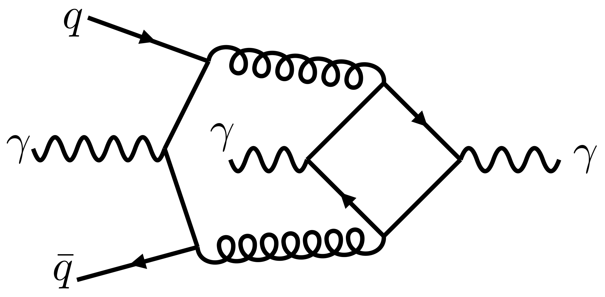
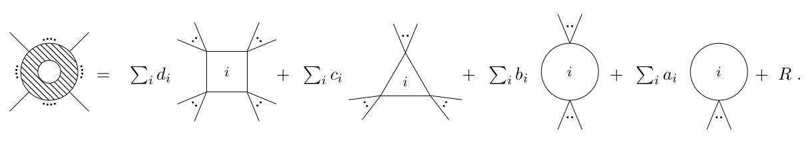
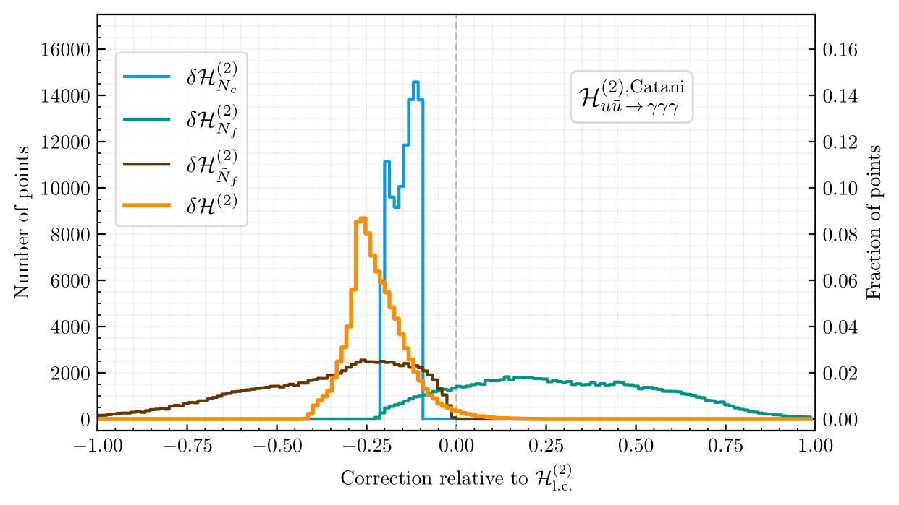
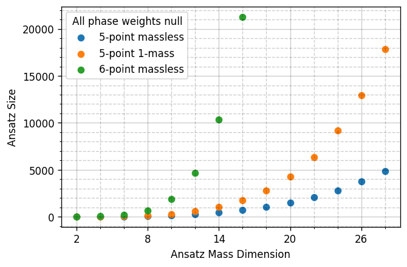

<html>
	<head>
		<link rel="stylesheet" href="https://fonts.googleapis.com/css?family=Indie+Flower">
		<link rel="stylesheet" href="../reveal_custom.css">
	</head>
</html>



<h3 style="margin-top:5mm;">
	<b style="margin-top:15mm;">
	    Non-planar two-loop QCD   corrections to $\boldsymbol{q\bar q \rightarrow \gamma\gamma\gamma}$:   
	    finite remainders in the spinor-helicity formalism 
	</b>
</h3>

Giuseppe De Laurentis
  
in collaboration with:  
 S. Abreu, H. Ita, M. Klinkert, B. Page, V. Sotnikov
  
based on: <a href="https://arxiv.org/abs/2305.17056">arXiv:2305.17056</a>

  

LoopFest XXI
  

   
  
Find these slides at  <a href="/slides/loopfestxxi_june2023/#/">gdelaurentis.github.io/slides/loopfestxxi_june2023</a> 

---

<section>



# Introduction

---

<b style="font-variant: small-caps; font-size: xxx-large;"> State-of-the-Art of</b>
<b style="font-size: 30pt; "> $\boldsymbol{\mathcal{A}^{(2-\textbf{loop})}_{\,n}}$</b>
 

     Five-point massless amplitudes in full color:  
     $\circ\,$ $pp\rightarrow \gamma jj$ <a style="font-size: large; display: inline-block; text-align: right; float: right; margin-top: 2mm; margin-left: 30mm; " href=https://arxiv.org/abs/2304.06682> Badger, Czakon, Hartanto, Moodie, Peraro, Poncelet, Zoia ('23) </a>   
     $\circ\,$ $pp\rightarrow \gamma\gamma j$ 
     <a style="font-size: large; display: inline-block; text-align: right; float: right; margin-top: 2mm; margin-left: 10mm; " href=https://arxiv.org/abs/2105.04585>
     	Agarwal, Buccioni, von Manteuffel, Tancredi ('21)
     </a>
     <a style="font-size: large; display: inline-block; text-align: right; float: right; margin-top: 2mm; margin-left: 10mm; " href=https://arxiv.org/abs/2106.08664>
     	Badger, Brønnum-Hansen, Chicherin, Gehrmann, Hartanto, Henn, Marcoli, Moodie, Peraro, Zoia ('21)
     </a>
        
     $\circ\,$ $pp\rightarrow \gamma\gamma\gamma$ <a style="font-size: large; display: inline-block; text-align: right; float: right; margin-top: 2mm; margin-left: 2mm; color: green; " href=https://indico.cern.ch/event/1227237/contributions/5397410/> This talk! </a> <a style="font-size: large; display: inline-block; text-align: right; float: right; margin-top: 2mm; margin-left: 30mm; " href=https://arxiv.org/abs/2305.17056> Abreu, GDL, Ita, Klinkert, Page, Sotnikov ('23);&nbsp </a>
      
     $\circ\,$ $pp\rightarrow jjj \quad (?)$ <a style="font-size: large; display: inline-block; text-align: right; float: right; margin-top: 2mm; margin-left: 2mm; color: green; " href=https://indico.cern.ch/event/1227237/contributions/5397411/> Next talk by Federico </a>
       
     Five-point one-mass amplitudes at leading color:  
     $\circ\,$ $pp\rightarrow Wb\bar b$ <a style="font-size: large; display: inline-block; text-align: right; float: right; margin-top: 2mm; margin-left: 30mm; " href=https://arxiv.org/abs/2102.02516> Badger, Hartanto, Zoia ('21) </a>  
     $\circ\,$ $pp\rightarrow Hb\bar b$ <a style="font-size: large; display: inline-block; text-align: right; float: right; margin-top: 2mm; margin-left: 30mm; " href=https://arxiv.org/abs/2107.14733> Badger, Hartanto, Kryś, Zoia ('21) </a>  
     $\circ\,$ $pp\rightarrow Wjj$ <a style="font-size: large; display: inline-block; text-align: right; float: right; margin-top: 2mm; margin-left: 2mm; color: green; " href=/slides/loopfestxxi_june2023/#/5> A bit about this towards the end of this talk! </a> <a style="font-size: large; display: inline-block; text-align: right; float: right; margin-top: 2mm; margin-left: 10mm; " href=https://arxiv.org/abs/2110.07541> Abreu, Febres Cordero, Ita, Klinkert, Page, Sotnikov ('21);&nbsp; </a>  
     $\circ\,$ $pp\rightarrow W\gamma j$ <a style="font-size: large; display: inline-block; text-align: right; float: right; margin-top: 2mm; margin-left: 30mm; " href=https://arxiv.org/abs/2201.04075> Badger, Hartanto, Kryś, Zoia ('22)
</a>

    Two-loop five-point amplitudes remain a challenge, but are now very much feasible.

---

<b style="font-variant: small-caps; font-size: xxx-large"> Sizable NNLO Corrections to </b> <b style="font-size: xxx-large"> $\boldsymbol{q\bar q \rightarrow \gamma\gamma\gamma}$ </b>

     $\circ\,$ NNLO cross-sections computed with leading-color double-virtual amplitudes

  

       
       <a style="font-size: large; text-align: center; float: center; margin-top: -10mm; margin-bottom: 0mm;" href=https://arxiv.org/abs/1911.00479>
       	  Chawdhry, Czakon, Mitov, Poncelet ('19)
       </a>
  

  

       
       <a style="font-size: large; text-align: center; float: center; margin-top: -10mm; margin-bottom: 0mm;" href=https://arxiv.org/abs/2010.04681>
       	  Kallweit, Sotnikov, Wiesemann ('20)
       </a>
  

     $\circ\,$ Analytic two-loop amplitudes in limit $N_c \rightarrow \infty \, , \; N_c/N_f = \text{const}.$

  

       <a style="font-size: large; text-align: center; float: center; margin-top: -10mm; margin-bottom: 0mm;" href=https://arxiv.org/abs/2012.13553>
       	  Chawdhry, Czakon, Mitov, Poncelet ('20)
       </a>
  

  

       <a style="font-size: large; text-align: center; float: center; margin-top: -10mm; margin-bottom: 0mm;" href=https://arxiv.org/abs/2010.15834>
       	  Abreu, Page, Pascual, Sotnikov ('20)
       </a>
  

    Question: are the subleading-color contributions trully negliegible?

---

<b style="font-variant: small-caps; font-size: xxx-large"> Gauge-Invariant Subamplitudes </b>
 

$$\require{color} \displaystyle 
    \mathcal{A}^{(2)}_{\,2q3\gamma} = \frac{N_c^2}{4}\left( {\color{green} A^{(2,0)}_{\,2q3\gamma} } - \frac{1}{N_c^2}(A^{(2,0)}_{\,2q3\gamma}+A^{(2,1)}_{\,2q3\gamma}) 
                              + \frac{1}{N_c^4} {\color{red} A^{(2,1)}_{\,2q3\gamma} } \right) \\[2mm]
    \qquad + C_F T_F N_f {\color{green} A^{(2,N_f)}_{\,2q3\gamma} } + C_F T_F \left(\sum_{f=1}^{N_f} Q_f^2\right) \, {\color{red} A^{(2,\tilde{N}_f)}_{\,2q3\gamma} } \, , $$

     $\circ\,$ Example diagram for each amplitude:

<table style="width: 100%; border: none; cellspacing: 0; cellpadding: 0; margin-bottom: 8mm; margin-top: 8mm; font-size: x-large;">
  <tr style="border:none; cellspacing: 0; cellpadding: 0; margin-bottom: 10mm; margin-top: 10mm;">
    <td style="border:none; cellspacing: 0; cellpadding: 0;"><b> ${\color{green} A^{(2, 0)}_{\,2q3\gamma} }$: </b></td>
    <td style="border:none; cellspacing: 0; cellpadding: 0;"><b>  </b></td>
    <td style="border:none; cellspacing: 0; cellpadding: 0;"><b>${\color{green} A^{(2, N_f)}_{\,2q3\gamma} }$: </b></td>
    <td style="border:none; cellspacing: 0; cellpadding: 0;"><b>  </b></td>
    <td style="border:none; cellspacing: 0; cellpadding: 0; color: green;"><b> Previously known </b></td>
  </tr>
  <tr style="border:none; cellspacing: 0; cellpadding: 0; margin-bottom: 10mm; margin-top: 10mm;">
    <td style="border:none; cellspacing: 0; cellpadding: 0;"><b>${\color{red} A^{(2, 1)}_{\,2q3\gamma} }$:</b></td>
    <td style="border:none; cellspacing: 0; cellpadding: 0;"><b>  </b></td>
    <td style="border:none; cellspacing: 0; cellpadding: 0;"><b>${\color{red} A^{(2, \tilde{N}_f)}_{\,2q3\gamma} }$: </b></td>
    <td style="border:none; cellspacing: 0; cellpadding: 0;"><b>  </b></td>
    <td style="border:none; cellspacing: 0; cellpadding: 0; color: red;"><b> New in this work </b></td>
  </tr>
</table>

</section>
---

---
<section>



<h1 style="margin-top: -2mm;"> Organization   of the Computation </h1>

---

<b style="font-variant: small-caps; font-size: xxx-large"> Generalized Unitarity </b>

$\circ$ Loop integrands can be written as

 

$$
\require{color}
\displaystyle A(\lambda, \tilde\lambda, \ell) = \sum_{\Gamma} \, \sum_{i \in M_\Gamma \cup S_\Gamma} \, c_{\,\Gamma,i}(\lambda, \tilde\lambda) \, \frac{m_{\Gamma,i}(\lambda\tilde\lambda, \ell)}{\textstyle \prod_{j} \rho_{\,\Gamma,j}(\lambda\tilde\lambda, \ell)}
$$

$\circ$ Generalized unitarity relates cuts of loop amplitudes to products of trees

	

	     $$
	     \require{color}
	     \displaystyle \sum_{\text{states}} \, \prod_{\text{trees}} A^{\text{tree}}(\lambda, \tilde\lambda, \ell|_{\text{cut}}) = \sum_{\substack{\Gamma' \ge \Gamma, \\ i \in M_\Gamma' \cup S_\Gamma'}} \kern-2mm c_{\,\Gamma',i}(\lambda, \tilde\lambda) \, \frac{m_{\Gamma',i}(\lambda\tilde\lambda, \ell|_{\text{cut}})}{\displaystyle \prod_{j\in P_{\Gamma'} / P_{\Gamma}} \rho_{j}(\lambda\tilde\lambda, \ell|_{\text{cut}})}
	     $$
	

	

	     

	     	  <tt> C++ code </tt>
	     
 
	     
	      
	     <a style="font-size: large; text-align: center; float: center; margin-top: -10mm; margin-bottom: 5mm;"
	     	href=https://arxiv.org/abs/2009.11957>
		
 Abreu, Dormans, 

		
 Febres Cordero, Ita  

		
 Kraus, Page, Pascual, 

		
 Ruf, Sotnikov ('20) 

	     </a>
	

     

	     $$
	     \left. \begin{aligned}
	     \underline{\text{Master integrands}}: \; & \int d^{D}\vec \ell \; \frac{m_{i\in M_\Gamma}}{\small \prod_j \rho_j} \neq 0 \\
	     \underline{\text{Surface terms}}: \; & \int d^{D}\vec \ell \; \frac{m_{i\in S_\Gamma}}{\small \prod_j \rho_j} = 0 \\
	     \end{aligned} \right\} \; \begin{aligned} & \text{Equivalent to} \\ & \text{IBP reduction} \end{aligned}
	     $$
          <a style="font-size: large; text-align: right; float: right; margin-right: 38mm; margin-top: -15mm; margin-bottom: 0mm;" href=https://arxiv.org/abs/1510.05626>
               Ita ('15)
          </a>
          
	

---

<b style="font-variant: small-caps; font-size: xxx-large"> Updates to Caravel </b>

     $\circ$ <b style="font-variant: small-caps; ">Main change</b>: new surface terms for non-planar topologies

$$
\require{color}
\begin{align}
\kern-25mm \text{IBP-generating vectors: } & \quad \displaystyle \int d^D \vec\ell \frac{\partial }{\partial \ell^\mu_a} \frac{v^\mu_a(\ell)}{\rho_1 \dots \rho_N} = 0 \quad (\text{in dim. reg.}) \\[2mm]
\kern-25mm \text{No propagator doubling: } & \quad \displaystyle \sum_{a, \mu} v^\mu_a(\ell) \frac{\partial \rho_i}{\partial \ell^\mu_a} - f_i(\ell)\rho_i = 0
\end{align}
$$

     $(v^\mu_a, f_i)$ form a <i>syzygy module</i>, solved for in <i>embedding space</i> using <code>Singular</code> + linear algebra.

 

     $\circ$ <b style="font-variant: small-caps; "> Additional changes </b>: 

 

     
 $\star$ semi-numerical $m_{i\in S_\Gamma}(\ell \leftarrow \text{analytical}, \lambda\tilde\lambda \leftarrow \text{numerical})$ from sparse systems; 

     
 $\star$ optimizations for Gaussian elimination of sparse systems; 

     $\star$ $c_{\Gamma,i}(\lambda, \tilde\lambda)$ instead of $c_{\Gamma,i}(\lambda\tilde\lambda)$ + conventions for the polarizations.

---

<b style="font-variant: small-caps; font-size: xxx-large; margin-bottom: 20mm;"> Finite remainders \& the   Rational / Transcendental split </b>

<!---

Decomposition in terms of <b> master integrals </b> 

<a style="font-size: large; text-align: right; float: right; margin-bottom: 5mm; margin-top: 10mm" href=https://arxiv.org/abs/0712.1851>Ellis, Zanderighi</a>
<a style="font-size: large; text-align: right; float: right; margin-bottom: 5mm; margin-top: 10mm" href=https://arxiv.org/abs/hep-ph/9212308>Bern, Dixon, Kosower;&nbsp</a>
<a style="font-size: large; text-align: right; float: right; margin-bottom: 5mm; margin-top: 10mm" href=https://www.sciencedirect.com/science/article/pii/0550321379906059?ref=pdf_download&fr=RR-2&rr=7c4afcac1f343b58>'t Hooft, Veltman;&nbsp</a>

$$A^{1-\text{loop},D=4}_{n} = \sum_i \color{orange}{d_i} \color{red}{I^i_{Box}} + \sum_i \color{orange}{c_i} \color{red}{I^i_{Triangle}} + \sum_i \color{orange}{b_i} \color{red}{I^i_{Bubble}} + \sum_i \color{orange}{a_i} \color{red}{I^i_{Tadpoles}} + \color{orange}{R}$$

       

--->

     $\circ$ In general, in $D= 4- 2 \epsilon$, with <i>pure</i> master integrals $I_{\Gamma, i}$ we have

$$ A^{\ell-loop}_n(\lambda, \tilde\lambda) = \sum_\Gamma \sum_{i \in M_\Gamma} \frac{\color{orange}{c_{\,\Gamma, i}}(\lambda, \tilde\lambda, \epsilon) \, \color{red}{I_{\Gamma, i}}(\lambda\tilde\lambda, \epsilon)}{\prod_j (\epsilon - a_{ij})}\;, \quad \text{with} \quad a_{ij} \in \mathbb{Q}$$

     $\circ$ For NNLO applications, we are interested in the <i>finite remainder</i>

$$ 
\mathcal{A}^{(2)}_R = \underbrace{\mathcal{R}}_{\text{finite remainder}} + \underbrace{I^{(1)}\mathcal{A}^{(1)}_R \quad + \quad I^{(2)}\mathcal{A}^{(0)}_R}_{\text{divergent + convention-dependent finite part}} + \mathcal{O}(\epsilon)
$$

     $\circ$ Finite remainder as a weighted sum of <i>pentagon functions</i> <a style="font-size: large; display: inline-block; text-align: right; float: right; margin-top: 2mm; margin-left: 4mm; " href=https://arxiv.org/abs/2009.07803> Chicherin, Sotnikov ('20);&nbsp; </a>

$$ 
\textstyle \mathcal{R}(\lambda, \tilde\lambda) = \sum_i \color{orange}{r_{i}(\lambda,\tilde\lambda)} \, \color{red}{h_i(\lambda\tilde\lambda)}
$$

    Reconstruct $\color{orange}{r_{i}(\lambda,\tilde\lambda)}$ from $\mathbb{F}_p$ samples

<a style="font-size: large; text-align: right; float: right; margin-top: -14mm; margin-bottom: 0mm;" href=https://arxiv.org/abs/1608.01902>
Peraro ('16)
</a>

<a style="font-size: large; text-align: right; float: right; margin-top: -20mm; margin-bottom: 0mm;" href=https://arxiv.org/abs/1406.4513>
     von Manteuffel, Schabinger ('14)
</a>

<!---

---

<b style="font-variant: small-caps; font-size: xxx-large"> Analytics from Numerics </b>

    Problem: direct analytic computation of the $c_{i,\Gamma}$ is not feasible.

     
     $\circ\,$ Floating-point evaluations ($\mathbb{R}$ or $\mathbb{C}$) would be sufficient for phenomenology.  
     $\phantom{\circ}\,$ But they are so unstable, even this won't work.

    
     $\circ\,$ Could try rational inputs ($\mathbb{Q}$), but integers grow way too large at intermediate stages.

     $\circ\,$  Finite fields  ($\mathbb{F}_p$) come to the rescue.  

<a style="font-size: large; text-align: right; float: right; margin-top: 5mm; margin-bottom: 0mm;" href=https://arxiv.org/abs/1608.01902>
   Peraro ('16)
</a>
<a style="font-size: large; text-align: right; float: right; margin-top: 5mm; margin-bottom: 0mm;" href=https://arxiv.org/abs/1406.4513>
   von Manteuffel, Schabinger ('14),&nbsp
</a>

     $\phantom{\circ}\,$ These are integers modulo a prime number $p$ (no precision issue!):  

 $\phantom{\circ}\,$ $\mathbb{F}_p = \{0, 1, 2, \dots, p-1\} \quad \text{with operations} \quad \{+, -, \times, \div \}$

     $\phantom{\circ}\,$ The prime $p$ needs to be large, to avoid accidental <tt> DivisionByZero </tt>.

     $\circ\,$ But we can't do phenomenology with $\mathbb{F}_p$ !   

    Solution: sample $c_{i,\Gamma}$ in $\mathbb{F}_p$ $\;\Rightarrow\;$ reconstruct analytic expression for $c_{i,\Gamma}$

--->

</section>
---
---

<section>



# Analytic Reconstruction

---

<b style="font-variant: small-caps; font-size: xxx-large"> The Least Common Denominator </b>
 

<!---

$\circ\,$ In least-common-denominator (LCD) form, we have

--->

     $\circ\,$ The $r_i(\lambda,\tilde\lambda)$ belong to the field of fractions over a poly. quotient ring, $FF(R_5)$

<a style="font-size: large; text-align: right; float: right; margin-top: 10mm; margin-bottom: 0mm;" href=https://arxiv.org/abs/2203.04269>
   GDL, Page ('22);&nbsp
</a> 
<a style="font-size: large; text-align: right; float: right; margin-top: -3mm; margin-bottom: 0mm;" href=https://arxiv.org/abs/2203.17170>
   Campbell, GDL, Ellis ('22)$\phantom{;\,}$
</a>

    $\displaystyle r_i(\lambda,\tilde\lambda) = \frac{\text{Num. poly}(\lambda,\tilde\lambda)}{\text{Denom. poly}(\lambda,\tilde\lambda)} = \frac{\text{Num. poly}(\lambda,\tilde\lambda)}{\prod_j W_j^{q_{ij}}(\lambda,\tilde\lambda)}$

     $\circ\,$ The denominator factors $W_j$ are conjectured to be restricted to the letters of the symbol alphabet

<a style="font-size: large; text-align: right; float: right; margin-top: 0mm; margin-bottom: 0mm;" href=https://arxiv.org/abs/1812.04586>
   Abreu, Dormans, Febres Cordero, Ita, Page ('18)
</a>

  

     $\displaystyle \{W_j\} = \bigcup_{\sigma \; \in \; \text{Aut}(R_5)} \sigma \circ \big\{ \langle 12 \rangle, \langle 1|2+3|1] \big\} {\quad\color{green}\text{Identical to 1-loop!}}$

     $\circ\,$ Why bother with spinor variables:

  

     
 $\star$ the LCD is <b>not</b> little group invariant: the degree is lower in spinors;  

     
 $\star$ no (arbitrary) split into parity even and odd: half sampling requirement; 

     $\star$ in <u>LCD form</u> we need $\color{green}29\,059$ evaluations instead of $\color{red}117\,810$ (with $s_{ij}$) for $\mathcal{R}^{(2)}_{2q3\gamma}$ .

---

<b style="font-variant: small-caps; font-size: xxx-large"> The Numerator Ansatz </b>
 

$\circ\,$ The numerator Ansatz takes the form

<a style="font-size: large; text-align: right; float: right; margin-top: -6mm; margin-bottom: 5mm;" href=https://arxiv.org/abs/1904.04067>
   GDL, Maître ('19)
</a>

$\displaystyle \text{Num. poly}(\lambda, \tilde\lambda) = \sum_{\vec \alpha, \vec \beta} c_{(\vec\alpha,\vec\beta)} \prod_{j=1}^n\prod_{i=1}^{j-1} \langle ij\rangle^{\alpha_{ij}} [ij]^{\beta_{ij}}$

     $\phantom{\circ}$ subject to constraints on $\vec\alpha,\vec\beta$ due to: 1) mass dimension; 2) little group; 3) linear independence.

 

$\circ\,$ Efficient implementation of the algorithm from Section 2.2 of <a href=https://arxiv.org/abs/2203.04269>Page, GDL ('22)</a> using

	

	     Gröbner bases $\rightarrow$ constrain $\vec\alpha,\vec\beta$
	       
	     <a style="font-size: large; text-align: center; float: center; margin-top: -10mm; margin-bottom: 5mm;"
	     href=https://www.singular.uni-kl.de/index.php.html>
		Decker, Greuel, Pfister, Schönemann
	     </a>	    
	

	

	     Integer programming $\rightarrow$ enumerate sols. $\vec\alpha,\vec\beta$  
	       
	     <a style="font-size: large; text-align: center; float: center; margin-top: -10mm; margin-bottom: 5mm;"
	     href=https://www.singular.uni-kl.de/index.php.html>
		Perron and Furnon (Google optimization team)
	     </a>
	

     

$\circ\,$ All linear systems solved with CUDA over $\mathbb{F}_{p\leq 2^{31}-1}$ on a laptop ($t_{\text{solving}} \ll t_{\text{sampling}}$)

---

<b style="font-variant: small-caps; font-size: xxx-large"> Taming the Algebraic Complexity </b>
 

$\circ\,$ In common denominator, we are massively over-parametrizing the coefficients. Thus, write:

    $\displaystyle r_i(\lambda,\tilde\lambda) = \frac{\mathcal{N}(\lambda,\tilde\lambda)}{\prod_j W_j^{q_{ij}}(\lambda,\tilde\lambda)} = \sum_k \frac{\mathcal{N}_k(\lambda,\tilde\lambda)}{\prod_j W_j^{q_{ijk}}(\lambda,\tilde\lambda)} = \sum_k r_{ik} \quad \text{with} \quad q_{ijk} \le q_{ij}$

$\circ\,$ Instead of probing $\mathcal{N}$ on $V(\big\langle W_x, W_y \big\rangle)$, use insights from physics, e.g.:

No denominator in $\mathcal{R}^{(2)}_{2q3\gamma}$ contains pairs of $\langle i |j + k | i]$

$\circ\,$ As by now standard, we pick a set of independent $r_i$ to reconstruct: $r_i \not\in \text{span}(r_{j\neq i})$.  
$\phantom{\circ\,}$ However, generally $r_{ik} \in \text{span}(r_{j\neq i})$ for some, but not all, $k$.

    $\displaystyle $

Write an Ansatz of the form: $r_i = \sum_{j\neq i} r_j + \sum_{k' \subset \{k\}} r_{ik'}$

$\phantom{\circ}$ For example, given the most complicated $r_i$, we only needed

    $\displaystyle \sum_{k' \subset \{k\}} r_{ik'} = \frac{⟨13⟩[14]^2⟨24⟩⟨34⟩[45]}{⟨45⟩⟨4|1+3|4]^3}-\frac{[14]⟨25⟩⟨34⟩^2[45]}{⟨45⟩^2⟨4|1+3|4]^2}-\frac{[14]⟨24⟩⟨34⟩⟨35⟩}{⟨45⟩^3⟨4|1+3|4]}$

</section>
---

---
<section>



# Towards   Phenomenology

---

<b style="font-variant: small-caps; font-size: xxx-large"> 
     SLC Corrections to the Hard Functions
</b>

     $\circ\,$ Full-color 2-loop remainders & 1-loop amplitudes implemented in an open-source <a href=https://gitlab.com/five-point-amplitudes/FivePointAmplitudes-cpp> <code> C++ Program</code> </a>

     $\circ\,$ To estimate the impact of the subleading-color contributions, consider the <i> 2-loop hard functions </i>

$\displaystyle \small \mathcal{H}^{(2)} = \sum_h |\mathcal{R}_h|^2 \Big/ \sum_h  |\mathcal{A}^{(0)}_h|$

  

       
  

  

       
  

    About $25\%-35\%$ correction to $\mathcal{H}^{(2)}_{\text{l.c.}}$. The correction to $\sigma^{\text{NNLO}}_{q\bar q \rightarrow \gamma\gamma\gamma}$ will be much smaller.

</section>
---

---
<section>



# Preview:   $pp\rightarrow Wjj$ Revisited

in collaboration with:  
 H. Ita, B. Page, V. Sotnikov

---

<b style="font-variant: small-caps; font-size: xxx-large; margin-bottom: 5mm;">
   Bottlneck for 
</b>
<b style="font-size: xxx-large; margin-bottom: 5mm;"> 
 $pp\rightarrow Wjj$ 
</b>
<b style="font-variant: small-caps; font-size: xxx-large; margin-bottom: 5mm;"> 
at NNLO
</b>

     $\;\circ\,$ No pheno study yet, despite the amplitudes have been available for almost 2 years!

     

          $\circ$ The algebraic complexity$-$think Ansatz size$-$grows quickly with multiplicity (m)   and mass dimension (d):   
          $\displaystyle \left(\mkern -9mu \begin{pmatrix}\, m(m-3)/2 \, \\ \, d/2 \, \end{pmatrix} \mkern -9mu \right)$   
          is a lower bound. <a style="font-size: large; display: inline-block; text-align: right; float: right; margin-left: -28mm; margin-top: 1mm; margin-bottom: 5mm;" href=https://arxiv.org/abs/2010.14525>
               GDL, Maître ('20)
          </a>
     

     

          
     

$\circ\,$ The anlytic expressions of <a href="https://arxiv.org/abs/2110.07541">Abreu, Febres Cordero, Ita, Klinkert, Page, Sotnikov ('21) </a> are 1.2GB.

    Having more control on the analytic structure starts to become important!

---

<b style="font-variant: small-caps; font-size: xxx-large; margin-bottom: 5mm;">
   Simplification strategy
</b>

$1.\,$ Script to split up the expressions, and compile them ($\sim 20$GB of <code>C++</code>) for evaluation over $\mathbb{F}_p$;

$2.\,$ Recombine the 3 projections $p_V \parallel p_1, p_V \parallel p_2, p_V \parallel p_3$ and reintroduce the little group factors   
to build 6-point spinor-helicity amplitudes (subject to degree bounds on $|5\rangle,[5|,|6\rangle,[6|$);  

$3.\,$ Perform a partial fraction decomposition based on expected structures and fit the Ansatze.

 

Comparison of $q\bar q \rightarrow \gamma \gamma \gamma$ (in full color) to $pp \rightarrow Wjj$ (at leading color):   

<table width=110% border="1" cellspacing="0" cellpadding="0" style="margin-left: -12mm; margin-bottom: 8mm; margin-top: 8mm; font-size: x-large;">
  <tr>
    <td><b>Kinematics</b></td>
    <td><b># Poles ($W$)</b></td>
    <td><b>LCD Ansatz</b></td>
    <td><b>Partial-Fraction Ansatz</b></td>
    <td><b>Rational Functions</b></td>
  </tr>
  <tr>
    <td style="text-align: center;">5-point massless</td>
    <td style="text-align: center;">30</td>
    <td style="text-align: center;">29k</td>
    <td style="text-align: center;">4k</td>
    <td style="text-align: center;">$\sim$300 KB</td>
  </tr>
  <tr>
    <td style="text-align: center;">5-point 1-mass</td>
    <td style="text-align: center;">>200</td>
    <td style="text-align: center;">>5M</td>
    <td style="text-align: center;">$\sim$40k</td>
    <td style="text-align: center; background-color: yellow;">$\sim$25 MB</td>
  </tr>
</table>

---

<b style="font-variant: small-caps; font-size: xx-large; margin-bottom: 10mm;">
   Analytic Structures of 2-loop 5-point 1-mass Amplitudes
</b>

$\circ\,$ Compact residues for the new 2-loop (spurious?) pole, $⟨k|j|p\mkern-7.5mu/_V|l|k]-⟨j|i|p\mkern-7.5mu/_V|l|j]$, e.g.:
$$r^{(5 \text{ of } 54)}_{\bar{u}^+g^+g^+d^-(V\rightarrow \ell^+ \ell^-)} = \frac{[12][23]⟨24⟩⟨46⟩^2⟨1|2+3|4]⟨2|1+3|4]}{⟨12⟩⟨23⟩⟨56⟩(⟨3|2|5+6|4|3]-⟨2|1|5+6|4|2])^2}$$

$\circ\,$ The three mass Grams, $\Delta_{12|34|p\mkern-7.5mu/_V}, \Delta_{14|23|p\mkern-7.5mu/_V}$, behave analogously to one-loop amplitudes, e.g.:

$$ r^{(73 \text{ of } 120)}_{\bar{u}^+g^-g^+d^-(V\rightarrow \ell^+ \ell^-)} = \frac{105}{128}\frac{⟨2|1+4|3]⟨4|2+3|1]⟨6|1+4|5]s_{14}s_{23}s_{56}(s_{124}-s_{134})(s_{123}-s_{234})(s_{25}+s_{26}+s_{35}+s_{36})}{⟨3|1+4|2]Δ_{23|14|56}^4} + \\
\Bigg[-6\frac{[12]^2⟨13⟩[25]⟨34⟩⟨36⟩⟨56⟩[56](s_{124}-s_{134})}{⟨3|1+4|2]^5}\Bigg] + \Bigg[ \; \Bigg]_{1234\rightarrow \overline{4321}}+ \mathcal{O}\left(\frac{1}{⟨3|1+4|2]^{4}Δ_{23|14|56}^{3}}\right)$$

$\phantom{\circ\,}$ but the pole orders have been (roughly) doubled.

$\circ\,$ Recall the primary decomposition for the non-radical ideal generated by $\small ⟨3|1+4|2]$ and $\small Δ_{23|14|56}$:
$$\small \kern-30mm \sqrt{\big\langle ⟨3|1+4|2], Δ_{23|14|56} \big\rangle_{R_6}} = \big\langle ⟨3|1+4|2], s_{124}-s_{134} \big\rangle_{R_6} $$ 
     

          <a href=https://arxiv.org/abs/2203.04269>
               GDL, Page ('22);&nbsp
          </a>  
          <a href=https://arxiv.org/abs/2203.17170>
               Campbell, GDL, Ellis ('22)$\phantom{;}$
          </a> 
     

</section>
---

---
<section data-visibility="uncounted">

<b style="font-variant: small-caps; font-size: xxx-large;"> Thank you   for your attention! </b>
  
<b style="font-variant: small-caps; font-size: xx-large;"> Questions? </b>

     Tired of beamer? These slides are powered by: 
     <a href="https://en.wikipedia.org/wiki/Markdown">markdown</a>, 
     <a href="https://en.wikipedia.org/wiki/HTML">html</a>, 
     <a href="https://revealjs.com/">revealjs</a>, 
     <a href="https://gohugo.io/">hugo</a>, 
     <a href="https://www.mathjax.org/">mathjax</a>, 
     <a href="https://github.com/">github</a>

 

     For open source packages: 
     <code>
          $   $ pip install [lips](https://github.com/GDeLaurentis/lips) [pyadic](https://github.com/GDeLaurentis/pyadic)
     </code>

</section>
---

---
<section data-visibility="uncounted">

# Backup Slides

</section>
---

---
<section data-visibility="uncounted">

# Absolute Values   on the Rationals

---

<b style="font-variant: small-caps; font-size: xxx-large"> Finite Fields </b>

     
     $\circ\,$ Any rational number, other than multiples of $1/p$, has an equivalent in the finite field $\mathbb{F}_p$.

 

     $\circ\,$ For example, let's work with $p=7$, i.e. with $\mathbb{F}_7 = \{0, 1, 2, 3, 4, 5, 6\}$:

 

     $-1$ is the additive inverse of 1

     $\Rightarrow \quad -1=6$ in $\mathbb{F}_7$, because $1+6 = 7 \, \% \, 7 = 0$

     $\frac{1}{3}$ is the multiplicative inverse of 3

     $\Rightarrow \quad \frac{1}{3}=5$ in $\mathbb{F}_7$, because $3 \times 5 = 15 \, \% \, 7= 1$

     $\phantom{\circ}\,$ The <i>Euclidean algorithm</i> allows to compute inverses without checking every entry.

     $\circ\,$ Numbers cannot grow out of control!

     $\frac{14611884945785561885978841755360860231120837652831038320107}{1853742276676202006476394341472012983521981235200}=1251868773$ in $\mathbb{F}_{2147483647}$

     $\phantom{\circ}\,$ $2147483647$ is $(2^{31}-1)$ which is the largest possible value $p$ working with 32-bits.

---

<b style="font-variant: small-caps; font-size: xxx-large"> $\boldsymbol p\,$-adic Numbers </b>

     
     $\circ\,$ We have again a problem, <b> in a finite field </b> 1 is not smaller than 2. In fact:

  

     
     $|x = 0|_{\mathbb{F}_p} = 0 \quad \text{and} \quad |x \neq 0|_{\mathbb{F}_p} = 1$

     
     $\phantom{\circ}\,$ Can't easily take limits, without dividing by zero.

 

    $\circ\,$ A $p$-adic number $x \in \mathbb{Q}_p$ is Laurent expansion in powers of the prime $p$

     
     $x = a_{\nu_p} p^{\nu_p} + \dots + a_{-1}p^{-1} + a_{0} p^{0} + a_1 p^1 + \dots $

    $\circ\,$ The $p$-adic absolute value is defined as (note the minus sign!)

     
     $|x|_{\mathbb{Q}_p} = p^{-\nu_p} \quad \Rightarrow \quad |p|_{\mathbb{Q}_p} < |1|_{\mathbb{Q}_p} < |\frac{1}{p}|_{\mathbb{Q}_p}$

    Retain integer arithmetics, while restoring the ability to take limits!

</section>
---

---
<section data-visibility="uncounted">

# Python Packages

---

<b style="font-variant: small-caps; font-size: xxx-large"> pyAdic </b>

     $\circ\,$ <tt>Pyadic</tt> provides flexible number types for finite fields and $p$-adic numbers in Python.   Related algorithms, such as rational reconstruction are also implemented.

<pre><code class="language-python" style="text-align: left; font-size: large; float: left; width: 100%; margin-left: -10mm;"> from pyadic import ModP
 from fractions import Fraction as Q
 ModP(Q(7, 13), 2147483647)
 <<< 1817101548 % 2147483647
 # Can also go back to rationals
 from pyadic.finite_field import rationalise
 rationalise(ModP(Q(7, 13), 2147483647))
 <<< Fraction(7, 13)
</code></pre>

---

<b style="font-variant: small-caps; font-size: xxx-large"> Lips </b>

     $\circ\,$ <tt>Lips</tt> is a phase-space generator and manipulator for 4-dimensional kinematics in any field, $\mathbb{C}, \mathbb{F}_p, \mathbb{Q}_p, \mathbb{Q}[i]$. It is particularly useful for spinor-helicity computations.

<pre><code class="language-python" style="text-align: left; font-size: large; float: left; width: 100%; margin-left: -10mm;"> from lips import Particles
 from lips.fields.field import Field
 # Random finite field phase space point, arbitrary multiplicity
 multiplicity = 5
 PSP = Particles(multiplicity, field=Field("finite field", 2 ** 31 - 1, 1), seed=0)
 # Evaluate an arbitrary complicated expression
 PSP("(8/3s23⟨24⟩[34])/(⟨15⟩⟨34⟩⟨45⟩⟨4|1+5|4])")
 <<< 683666045 % 2147483647
</code></pre>

     $\circ\,$ It can also be used to generate points in singular configuration.

</section>
---

---
<section data-visibility="uncounted">
# Spinor Helicity

---

<b style="font-variant: small-caps; font-size: xxx-large">  Representations of the Lorentz group </b>

(Recall: $\mathfrak{so}(1, 3)_\mathbb{C} \sim \mathfrak{su}(2) \times \mathfrak{su}(2)$)
 

| $\boldsymbol{(j\_{-},j\_{+})}$ | dim. | name | quantum field | kinematic variable |
| :-------------: | :-------------: | :------------- | :-------------: | :-------------: |
| (0,0) | 1 | scalar | $h$ | m |
| (0,1/2) | 2 | right-handed Weyl spinor | $\chi_{R\,\alpha}$ | $\lambda_\alpha$ |
| (1/2,0) | 2 | left-handed Weyl spinor | $\chi_L^{\,\dot\alpha}$ | $\bar{\lambda}^{\dot\alpha}$ |
| (1/2,1/2) | 4 | rank-two spinor/four vector | $A^\mu/A^{\dot\alpha\alpha}$ | $P^\mu/P^{\dot\alpha\alpha}$ |
| (1/2,0)$\oplus$(0,1/2) | 4 | bispinor (Dirac spinor) | $\Psi$ | $u, v$ |

---

<b style="font-variant: small-caps; font-size: xxx-large">  Spinor Covariants </b>
 

Weyl spinors are sufficient for massless particles:

$\text{det}(P^{\dot\alpha\alpha})=m^2 \rightarrow 0 \quad \Longrightarrow \quad P^{\dot\alpha\alpha} = \bar\lambda^{\dot\alpha}\lambda^\alpha$.

 
In terms of 4-momentum components we have:

$$
\lambda\_\alpha=\frac{1}{\sqrt{p^0+p^3}}\begin{pmatrix}p^0+p^3 \\\ p^1+ip^2\end{pmatrix} \, , \;\;\; \lambda^\alpha=\epsilon^{\alpha\beta} \lambda_\beta =\frac{1}{\sqrt{p^0+p^3}}\begin{pmatrix}p^1+ip^2 \\\ -p^0+p^3\end{pmatrix}
$$

$\bar\lambda\_{\dot\alpha}=\frac{1}{\sqrt{p^0+p^3}}\begin{pmatrix}p^0+p^3 \\\ p^1-ip^2\end{pmatrix} \, , \;\;\; \bar\lambda^{\dot\alpha}=\epsilon^{\dot\alpha\dot\beta}\bar\lambda_{\dot\beta}=\frac{1}{\sqrt{p^0+p^3}}\begin{pmatrix}p^1-ip^2 \\\ \-p^0+p^3\end{pmatrix}$

 

$$
\bar\lambda\_{\dot\alpha} = (\lambda\_\alpha)^* \quad if \quad p^i \in \mathbb{R}; \quad \quad \bar\lambda\_{\dot\alpha} \neq (\lambda\_\alpha)^* \quad if \quad p^i \in \mathbb{C}
$$

---

<b style="font-variant: small-caps; font-size: xxx-large">  Spinor Invariants </b>
 

$$
⟨ij⟩ = λ_iλ_j = (λ_i)^α(λ_j)_α \quad \quad \quad [ij] = \barλ_i\barλ_j = (\barλ_i)\_\dotα(\barλ_j)^\dotα
$$

$$
s_{ij} = ⟨ij⟩[ji]
$$

$$
⟨i\;|\;(j+k)\;|\;l] = (λ_i)^α (\not P_j + \not P_k )\_{α\dotα} \barλ_l^\dotα
$$

$$
⟨i\;|\;(j+k)\;|\;(l+m)\;|\;n⟩ = (λ_i)^α (\not P_j + \not P_k )\_{α \dot α} (\bar{\not P_l} + \bar{\not P_m} )^{\dot α α} (λ_n)_α
$$

$$
tr_5(ijkl) = tr(\gamma^5 \not P_i \not P_j \not P_k \not P_l) =  [i\,|\,j\,|\,k\,|\,l\,|\,i⟩ - ⟨i\,|\,j\,|\,k\,|\,l\,|\,i]
$$

</section>
---

---
<section>



    

# The Geometry of Phase Space

    

based on: [GDL, Page (JHEP 12 (2022) 140)](https://arxiv.org/abs/2203.04269)

---

<b style="font-variant: small-caps; font-size: xxx-large"> Least Common Denominator Redux </b>

$\circ\,$ Can't draw pictures in high (complex) dimensions, so let's consider the simplified case $\mathbb{R}[x, y, z]$.

$\circ\,$ Denominator factors $W_j$ correspond to <i> singular surfaces </i>.

	

	       
	     ${\color{orange}W_1 = (xy^2 + y^3 - z^2)}$
	

	

	     Say we have:
	

	

	     $W_1 = xy^2 + y^3 - z^2$  
	

	

	     A function $c_i(x,y,z)$ may or may not have $W_1$ as a pole, depending on what happens on the orange surface
	

	

	     $\displaystyle \lim_{W_j \rightarrow \epsilon} c_i(x,y,z) \sim \frac{1}{\epsilon^{q_{ij}}} $
	

        

    The LCD tells us about what happens on surfaces with one less dimension than the full space.

---

<b style="font-variant: small-caps; font-size: xxx-large"> Multivariate Partial Fractions </b>

$\circ\,$ To distinguish $\displaystyle \frac{1}{W_1W_2}$ from $\displaystyle \frac{1}{W_1} + \frac{1}{W_2}$, look at $W_1 \sim W_2 \rightarrow \epsilon \ll 1$. Geometrically:

	

	       
	     ${\color{orange}W_1 = (xy^2 + y^3 - z^2)}$
	

	

	       
	     ${\color{blue}W_2 = (x^3 + y^3 - z^2)}$
	

	

	       
	     $V(W_1) \cap V(W_2)$
	

$\circ\,$ <i> Primary decompositions </i> of sets of polynomials (<i> ideals </i>), anogous to integers:

	

	     $60 = 5 \times 3 \times 2^2$
	

	

	     $({\color{orange}xy^2 + y^3 - z^2}, {\color{blue}x^3 + y^3 - z^2}) = \\
	     {\color{magenta}(z^2,x+y)} \cup {\color{green}(y^3-z^2,x)} \cup {\color{red}(2y^3-z^2,x-y)}$
	

    Partial-fraction decompositions tell us about the relations between poles.

</section>
---