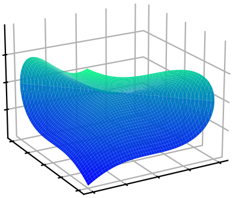

<html>
	<head>
		<link rel="stylesheet" href="https://fonts.googleapis.com/css?family=Indie+Flower">
		<link rel="stylesheet" href="../reveal_custom.css">
	</head>
</html>



<h3 style="margin-top:5mm; margin-left: -10mm; margin-right: -10mm;">
	<b style="margin-top:15mm; ">
	    Mathematical and Physical Structures   
	    of Rational Functions in Scattering Amplitudes 
	</b>
</h3>

<b style="font-size: 14pt; "> Title for Mathematicians: </b>
<b style="font-size: 14pt; "> Vector Spaces over Fraction Fields of Polynomial Quotient Rings </b>

Giuseppe De Laurentis
 

 Paul Scherrer Institut / University of Edinburgh 

 
<a href="https://arxiv.org/abs/2203.04269">arXiv:2203.04269</a> 
 (GDL, B. Page) 

<a href="https://arxiv.org/abs/2305.17056">arXiv:2305.17056</a> 
 (S. Abreu, GDL, H. Ita, M. Klinkert, B. Page, V. Sotnikov) 

MathemAmplitudes 2023 - Padova
 

   
  
Find these slides at  <a href="/slides/mathemamplitudes_sept2023/#/">gdelaurentis.github.io/slides/mathemamplitudes_sept2023</a> 

---

<section>



# Introduction

--- 

<b style="font-variant: small-caps; font-size: xxx-large"> Scattering Amplitudes </b>

     $\circ$ Amplitude (integrands) can be written as

 

$$
     \require{color}
     \require{amsmath}
     \displaystyle A(\lambda, \tilde\lambda, \ell) =
\sum_{\substack{\Gamma,\\ i \in M_\Gamma \cup S_\Gamma}} \, c_{\,\Gamma,i}(\lambda, \tilde\lambda, \epsilon) \,		\frac{m_{\Gamma,i}(\lambda\tilde\lambda, \ell)}{\textstyle \prod_{j} \rho_{\,\Gamma,j}(\lambda\tilde\lambda, \ell)} \;\; \xrightarrow[]{\int d^D\ell} \;\; \sum_{\substack{\Gamma,\\ i \in M_\Gamma}} {\color{red}c_{\,\Gamma, i}}(\lambda, \tilde\lambda, \epsilon) \, {\color{orange}I_{\Gamma, i}}(\lambda\tilde\lambda, \epsilon)
     $$

 

     $\circ$ For a suitable choice of integrands, we get:

 

     $$
     \displaystyle
     {\color{red}c_{\Gamma, i}}(\lambda, \tilde\lambda, \epsilon) = \frac{ \sum_{k=0}^{\text{finite}} \, {\color{red}c^{(k)}_{\,\Gamma, i}}(\lambda, \tilde\lambda) \, \epsilon^k}{\prod_j (\epsilon - a_{ij})} \;, \;\;\text{with} \quad a_{ij} \in \mathbb{Q}
     $$

 

     Some notation:

 

     $\circ$  $\Gamma$: topologies $\quad\circ$ $M_\Gamma$: masters $\quad\circ$ $S_\Gamma$: surface terms

     $\circ$ Spinors: $\lambda_i = |i\rangle, \tilde\lambda_i =[i|$
     $\quad\circ$ 4-momenta: $\lambda\tilde\lambda=p\kern-3mm/$
     $\quad\circ$ Loop $D$-momenta: $\ell $

---

<b style="font-variant: small-caps; font-size: xxx-large"> Outline</b>

     Disclaimer: I will focus on the $c_{\,\Gamma, i}^{(k)}(\lambda, \tilde\lambda)$ $-$ call them $c_i(\lambda, \tilde\lambda)$ for short,  
     nevertheless some concepts can be extended to whole amplitudes.

     <b> We will discuss: </b>

  

     $1.$ Where are the poles? What is their order?	 

     $2.$ Relation between pole structure, and analytic constriants (e.g. partial fraction decomposition)

     $3.$ Reconstructing sets of functions: Why is it easier than reconstructing individual ones?

     $4.$ Example process @ 2-loop: $pp \rightarrow \gamma\gamma\gamma$, $pp \rightarrow Wjj$ (preliminary)

    

     <b> Key take away: </b>

 

     What is important is not the number of variables,  
     but the size of the parametrization (a.k.a. Ansatz), and our ability to constrain it.	 

---

<b style="font-variant: small-caps; font-size: xxx-large;"> Polynomial Quotient Rings  </b>

     $\circ$ Let us start from the polynomial ring of spinor components

 

     $$\displaystyle \kern-50mm S_n = \mathbb{F}\left[|1⟩, [1|, \dots, |n⟩, [n|\right]$$

 

     $\phantom{\circ}$ the field $\mathbb{F}$ can be any of $\mathbb{Q},\mathbb{R},\mathbb{C},\mathbb{F}_p,\mathbb{Q}_p,\dots$

 

     $\circ$ Define the momentum-conservation ideal as

     $$
     \displaystyle J_{\Lambda_n} = \Big\langle \sum_i |i⟩[i| \Big\rangle_{S_n}
     $$

     
      
     

     	  Artist's Impression of $V(J_{\Lambda_n})$   I can't draw in $4n$ dims!
     

 

     $\phantom{\circ}$ physically, two polynomials $p$ and $q$ are equivalent if $p-q\in J_{\Lambda_n}$

 

     $\circ$ This defines the needed polynomial <b>quotient</b> ring$\kern-4mm\phantom{x}^{\star}$: $\;R_n = S_n / J_{\Lambda_n} $

 

    $c^{(k)}_{\Gamma,i}$ at $n$-point belong to the Field of Fractions$\kern-4mm\phantom{x}^{\dagger}$ of $R_n$

     $\kern-4mm\phantom{x}^\star R_4$ is "weird", but it proves that polynomial rings are not sufficient;
     $\quad\kern-4mm\phantom{x}^\dagger$ The field of fractions of $R_3$ does not exist.

</section>
---

---
<section>



<h1 style="margin-top: -2mm;"> The Pole Structure </h1>

---

<b style="font-variant: small-caps; font-size: xxx-large"> Prime Ideals \& Irreducible Varieties  </b>

     $\circ$ Let us consider a very simple example

 

     $\displaystyle \kern-50mm iA_{g^-g^-g^+g^+}^{\text{tree}} = \frac{\langle 12 \rangle^3}{\langle 23 \rangle \langle 34 \rangle \langle 41 \rangle} = \frac{[34]^3}{[12][23][41]} $

 

     $\phantom{\circ}$ is, say, $\langle 23 \rangle$ a pole of this amplitude?

     
      
     

     	  Artist's Impression of $V(\big\langle \langle 23 \rangle\big\rangle_{R_4})$
     

 

     $\circ$ The question is ill posed!

 

     $\phantom{\circ} \langle 23 \rangle$ does not identify an irreducible variety in $R_4$.

 

     $\phantom{\circ}$ Compute $\color{green}\text{primary decompositions}$, such as

 

     $\displaystyle \big\langle \langle 23\rangle \big\rangle_{R_4} = {\color{orange} \big\langle \langle 23\rangle, [14] \big\rangle_{R_4}} \cap {\color{blue} \big\langle \langle 12\rangle, \langle 13 \rangle, \langle 14\rangle, \langle 23\rangle, \langle 24 \rangle, \langle 34 \rangle \big\rangle_{R_4}} $

 

     $\phantom{\circ}$ On the <b style="color: orange"> first branch </b> there is a simple pole, on the <b style="color: blue"> latter branch </b> the amplitude is regular.

    Poles & Zeros $\;\Leftrightarrow\;$ Irreducible Varieties $\;\Leftrightarrow\;$ Prime Ideals  
    <i style="font-size: 12pt; border-top: -8mm; border-bottom: -2mm;"> Physics $\kern38mm$ Geometry $\kern38mm$ Algebra </i>

---

<b style="font-variant: small-caps; font-size: xxx-large"> Bootstrapping Trees (?) </b>

     $\circ$ The degree of divergence / vanishing on various surfaces imposes strong constraints, e.g.

     $ A^{\text{tree}}_{q^+g^+g^+\bar q^-g^-g^-} = \frac{\mathcal{N(\text{m.d.} = 6\,,\; \text{p.w.} = [-1, 0, 0, 1, 0, 0])}}{\langle 12\rangle\langle 23\rangle\langle 34\rangle [45][56][61]s_{345}}$

     $\circ$ Pretend this is un unknown integral coefficient, $\mathcal{N}$ has 143 free parameters.

     $\circ$ List the various prime ideal, such as

   

     $ \big\langle \langle 12\rangle, \langle 23\rangle, \langle 13\rangle \big\rangle, \; \big\langle |1\rangle \big\rangle, \; \big\langle \langle 12\rangle, |1+2|3]\big\rangle, \dots$

     $\phantom{\circ}$ and impose that $\mathcal{N}$ vanishes to the correct order. We determine it up to an overall constant.

<a style="font-size: large; text-align: right; float: right; margin-top: -2mm; margin-bottom: 0mm;" href=https://arxiv.org/abs/.>
     GDL, Page ('22)
</a>

     $\circ$ Likewise, the ansatz for $A^{\text{tree}}_{g^+g^+g^+ g^-g^-g^-}$ shrinks $1326 \rightarrow 1$, etc..

   

     <i> Effectively we can <b> compute </b> trees, just from their <u>poles orders</u>.   Note: compared to BCFW there is <u>no</u> information about <u>residues</u>. </i>

---

<b style="font-variant: small-caps; font-size: xxx-large"> Partial Fraction Decompositions </b>

     $\circ$ For true integral coefficients, we can't rely on the Ansatz to shrinks to an overall constant.

     $\circ$ Partial fraction decompositions (PFDs) are a popular method to tame algebraic complexity.

     $\circ$ In my opinion, a PFD algorithm needs

   

     $1.$ to say if two poles $W_a$ and $W_b$ are separable into different fractions;  
     $2.$ to answer $(1.)$ without having access to an analytic expression. 

     $\circ$ Hilbert's nullstellensatz: if $\mathcal{N}$ vanishes on all branches of $\langle W_a, W_b \rangle$, then the PFD is possible$\kern-3mm\phantom{x}^\dagger$.

     $\circ$ Generalizing to powers $>\kern-1mm 1$ is possible, but non-trivial (symbolic powers, Zariski-Nagata)

<a style="font-size: large; text-align: right; float: right; margin-top: 0mm; margin-bottom: 0mm;" href=https://arxiv.org/abs/.>
   GDL, Page ('22)
</a>

     $\circ$ Similarly, generalizing to non-radical ideals requires ring extensions

<a style="font-size: large; text-align: right; float: right; margin-top: 0mm; margin-bottom: 0mm; margin-right: 33mm;" href=https://arxiv.org/abs/.>
   Campbell, GDL, Ellis ('22)
</a>

     <b> Issue: </b>evaluations on singular surfaces are expensive.

     <b> Opportunity: </b>we get more than partial fraction decompositions.

      

     $\kern-4mm\phantom{x}^\dagger$ $\langle W_a, W_b\rangle$ needs to be radical.

---

<b style="font-variant: small-caps; font-size: xxx-large"> Beyond Partial Fractions </b>

     $\circ$ Case 0: the ideal does not involve denominator factors

 

     $\circ$ Case 1: the degree of vanishing is non-uniform

 

     $\circ$ Case 2: ideal is non-radical

</section>
---
---

<section>



# Analytic Reconstruction

---

<b style="font-variant: small-caps; font-size: xxx-large"> Choosing Independent Functions </b>
 

     $\circ$ The set $c_{\Gamma,i}$ can be very large, so pick a set of independent ones, and write:

     $\displaystyle c_{\Gamma,i} = \tilde{c}_{\Gamma,j} M_{ji} \quad \text{with} \quad M_{ji} \in \mathbb{Q}$ 

     $\phantom{\circ}$ with $\tilde{c}^{(k)}_{\Gamma,j}$ an independent subset of $c^{(k)}_{\Gamma,i}$.  
     $\phantom{\circ}\Rightarrow$ $M_{ji}$ is, up to a permutation of columns, in row reduced echelon form.

     $\circ$ We might as well use a set $\tilde{c}^{(k)}_{\Gamma,j}$ which is not a subset of $c^{(k)}_{\Gamma,i}$,  
     $\phantom{\circ}$ at the trivial cost of having a different $M_{ji}$.

     $\circ$ Consider a PFD of one of the $\tilde{c}^{(k)}_{\Gamma,i}$ - call it $c_i$ for short

    $\displaystyle c_i(\lambda,\tilde\lambda) = \frac{\mathcal{N}_i(\lambda,\tilde\lambda)}{\prod_j W_j^{q_{ij}}(\lambda,\tilde\lambda)} = \sum_k \frac{\mathcal{N}_{ik}(\lambda,\tilde\lambda)}{\prod_j W_j^{q_{ijk}}(\lambda,\tilde\lambda)} = \sum_k c_{ik}(\lambda,\tilde\lambda)$

     $\phantom{\circ}$ We cannot have $c_i \in \text{span}(c_{j\neq i})$, but we can have $c_{ik} \in \text{span}(c_{j\neq i})$, for some, but not all, $k$.

---

<b style="font-variant: small-caps; font-size: xxx-large"> Least Least-Common-Denominator </b>
 

$\displaystyle \tilde{c}_i = \sum_{j\neq i} q_j \tilde{c}_j + c'_{i}$

    Reconstructing a set of $c^{(k)}_{\Gamma,i}$ is not as bad as reconstructing the most complex function in the set.

</section>
---

---
<section>



# Example   processes
---

<b style="font-variant: small-caps; font-size: xxx-large"> Three-photon production at two loops </b>
 

     $\circ\,$ The denominator factors $W_j$ are conjectured to be restricted to the letters of the symbol alphabet

<a style="font-size: large; text-align: right; float: right; margin-top: 0mm; margin-bottom: 0mm;" href=https://arxiv.org/abs/1812.04586>
   Abreu, Dormans, Febres Cordero, Ita, Page ('18)
</a>

  

     $\displaystyle \{W_j\} = \bigcup_{\sigma \; \in \; \text{Aut}(R_5)} \sigma \circ \big\{ \langle 12 \rangle, \langle 1|2+3|1] \big\} {\quad\color{green}\text{Identical to 1-loop!}}$

     $\circ\,$ Advantages of spinor variables:

  

     
 $\star$ the LCD is <b>not</b> little group invariant: the degree is lower in spinors;  

     
 $\star$ no (arbitrary) split into parity even and odd: half sampling requirement; 

     $\star$ in <u>LCD form</u> we would need $\color{green}29\,059$ evaluations instead of $\color{red}117\,810$ (with $s_{ij}$) for $\mathcal{R}^{(2)}_{2q3\gamma}$ .

---

<b style="font-variant: small-caps; font-size: xxx-large"> Taming the Algebraic Complexity </b>
 

$\circ\,$ Instead of the common denominator form, perform a partial fraction decomposition

    $\displaystyle r_i(\lambda,\tilde\lambda) = \frac{\mathcal{N}(\lambda,\tilde\lambda)}{\prod_j W_j^{q_{ij}}(\lambda,\tilde\lambda)} = \sum_k \frac{\mathcal{N}_k(\lambda,\tilde\lambda)}{\prod_j W_j^{q_{ijk}}(\lambda,\tilde\lambda)} = \sum_k r_{ik} \quad \text{with} \quad q_{ijk} \le q_{ij}$

$\circ\,$ Use insights from physics, e.g. no denominator in $\mathcal{R}^{(2)}_{2q3\gamma}$ contains more than a single $\langle i |j + k | i]$

$\circ\,$ As by now standard, we pick a set of independent $r_i$ to reconstruct: $r_i \not\in \text{span}(r_{j\neq i})$.  
$\phantom{\circ\,}$ However, generally $r_{ik} \in \text{span}(r_{j\neq i})$ for some, but not all, $k$. Thus, write:

    $\displaystyle $

$r_i = \sum_{j\neq i} c_j r_j + \sum_{k' \subset \{k\}} r_{ik'}$

 

Sampling requirement reduced from $\color{red}29\,059$ to $\color{green}4\,003$ points.

$\circ$ For example, a posteriori, we find that for the most complicated $r_i$, we only needed

    $\displaystyle \sum_{k' \subset \{k\}} r_{ik'} = \frac{⟨13⟩[14]^2⟨24⟩⟨34⟩[45]}{⟨45⟩⟨4|1+3|4]^3}-\frac{[14]⟨25⟩⟨34⟩^2[45]}{⟨45⟩^2⟨4|1+3|4]^2}-\frac{[14]⟨24⟩⟨34⟩⟨35⟩}{⟨45⟩^3⟨4|1+3|4]}$

---

<b style="font-variant: small-caps; font-size: xxx-large; margin-bottom: 5mm;">
   Bottlneck for 
</b>
<b style="font-size: xxx-large; margin-bottom: 5mm;"> 
 $pp\rightarrow Wjj$ 
</b>
<b style="font-variant: small-caps; font-size: xxx-large; margin-bottom: 5mm;"> 
at NNLO
</b>

     $\;\circ\,$ No pheno study yet, despite the amplitudes have been available for almost 2 years!

     

          $\circ$ The algebraic complexity$-$think Ansatz size$-$grows quickly with multiplicity (m)   and mass dimension (d):   
          $\displaystyle \left(\mkern -9mu \begin{pmatrix}\, m(m-3)/2 \, \\ \, d/2 \, \end{pmatrix} \mkern -9mu \right)$   
          is a lower bound. <a style="font-size: large; display: inline-block; text-align: right; float: right; margin-left: -28mm; margin-top: 1mm; margin-bottom: 5mm;" href=https://arxiv.org/abs/2010.14525>
               GDL, Maître ('20)
          </a>
     

     

          
     

$\circ\,$ The anlytic expressions of <a href="https://arxiv.org/abs/2110.07541">Abreu, Febres Cordero, Ita, Klinkert, Page, Sotnikov ('21) </a> are 1.2GB.

    Having more control on the analytic structure starts to become important!

---

<b style="font-variant: small-caps; font-size: xxx-large; margin-bottom: 5mm;">
   Simplification strategy for $pp\rightarrow Wjj$
</b>

$1.\,$ Script to split up the expressions, and compile them ($\sim 20$GB of <code>C++</code>) for evaluation over $\mathbb{F}_p$;

$2.\,$ Recombine the 3 projections $p_V \parallel p_1, p_V \parallel p_2, p_V \parallel p_3$ and reintroduce the little group factors   
to build 6-point spinor-helicity amplitudes (subject to degree bounds on $|5\rangle,[5|,|6\rangle,[6|$);  

$3.\,$ Perform partial fraction decompositions$^{*}$ based on expected structures and fit the Ansatze.

 

Comparison of $q\bar q \rightarrow \gamma \gamma \gamma$ (in full color) to $pp \rightarrow Wjj$ (at leading color):   

<table width=110% border="1" cellspacing="0" cellpadding="0" style="margin-left: -12mm; margin-bottom: 8mm; margin-top: 8mm; font-size: x-large;">
  <tr>
    <td><b>Kinematics</b></td>
    <td><b># Poles ($W$)</b></td>
    <td><b>LCD Ansatz</b></td>
    <td><b>Partial-Fraction Ansatz</b></td>
    <td><b>Rational Functions</b></td>
  </tr>
  <tr>
    <td style="text-align: center;">5-point massless</td>
    <td style="text-align: center;">30</td>
    <td style="text-align: center;">29k</td>
    <td style="text-align: center;">4k</td>
    <td style="text-align: center;">$\sim$300 KB</td>
  </tr>
  <tr>
    <td style="text-align: center;">5-point 1-mass</td>
    <td style="text-align: center;">>200</td>
    <td style="text-align: center;">>5M</td>
    <td style="text-align: center;">$\sim$40k</td>
    <td style="text-align: center; background-color: yellow;">$\sim$25 MB</td>
  </tr>
</table>

     $\displaystyle \kern-10mm \{W_j\} = \bigcup_{\sigma \; \in \; \text{Aut}(R_6)} \sigma \circ \big\{ \langle 12 \rangle, \langle 1|2+3|1], \langle 1|2+3|4], s_{123}, \Delta_{12|34|56}, ⟨3|2|5+6|4|3]-⟨2|1|5+6|4|2] \big\} $

 

$\phantom{x}^{*}$ sometimes it's actually a bit more than a partial fraction decomposition, see next slide.

---

<b style="font-variant: small-caps; font-size: xx-large; margin-bottom: 10mm;">
   Analytic Structures of 2-loop 5-point 1-mass Amplitudes
</b>

$\circ\,$ Compact residues for the new 2-loop (spurious?) pole, $⟨k|j|p\mkern-7.5mu/_V|l|k]-⟨j|i|p\mkern-7.5mu/_V|l|j]$, e.g.:
$$r^{(5 \text{ of } 54)}_{\bar{u}^+g^+g^+d^-(V\rightarrow \ell^+ \ell^-)} = \frac{[12][23]⟨24⟩⟨46⟩^2⟨1|2+3|4]⟨2|1+3|4]}{⟨12⟩⟨23⟩⟨56⟩(⟨3|2|5+6|4|3]-⟨2|1|5+6|4|2])^2}$$

$\circ\,$ The three mass Grams, $\Delta_{12|34|p_V}, \Delta_{14|23|p_V}$, behave analogously to one-loop amplitudes, e.g.:

$$ r^{(73 \text{ of } 120)}_{\bar{u}^+g^-g^+d^-(V\rightarrow \ell^+ \ell^-)} = \frac{105}{128}\frac{⟨2|1+4|3]⟨4|2+3|1]⟨6|1+4|5]s_{14}s_{23}s_{56}{\color{green}(s_{124}-s_{134})}(s_{123}-s_{234})(s_{25}+s_{26}+s_{35}+s_{36})}{{\color{orange}⟨3|1+4|2]}{\color{red}Δ_{23|14|56}^4}} + \\
\Bigg[-6\frac{[12]^2⟨13⟩[25]⟨34⟩⟨36⟩⟨56⟩[56]{\color{green}(s_{124}-s_{134})}}{{\color{orange}⟨3|1+4|2]^5}}\Bigg] + \Bigg[ \; \Bigg]_{1234\rightarrow \overline{4321}}+ \mathcal{O}\left(\frac{1}{⟨3|1+4|2]^{4}Δ_{23|14|56}^{3}}\right)$$

$\phantom{\circ\,}$ but the pole orders have been doubled, see <a href=https://arxiv.org/abs/hep-ph/9708239> Bern, Dixon, Kosower ('97) </a> 

$\circ\,$ $\small Δ_{23|14|56}$ behaves as a perfect square on the surface where $\small ⟨3|1+4|2]$ vanishes:
$$\small \kern-30mm \sqrt{\big\langle {\color{orange}⟨3|1+4|2]}, {\color{red}Δ_{23|14|56}} \big\rangle_{R_6}} = \big\langle {\color{orange}⟨3|1+4|2]}, {\color{green}s_{124}-s_{134}} \big\rangle_{R_6} $$
     

          <a href=https://arxiv.org/abs/2203.04269>
               GDL, Page ('22);&nbsp
          </a>  
          <a href=https://arxiv.org/abs/2203.17170>
               Campbell, GDL, Ellis ('22)$\phantom{;}$
          </a> 
     

</section>
---

---
<section>

<!---
<b style="font-variant: small-caps; font-size: xxx-large; margin-bottom: 10mm;">
   Conclusions
</b>

     $\circ\,$ Full-color 5-point massless amplitudes are well within reach, 

     $\circ\,$ Subleading color corrections can be fairly sizable

     $\circ\,$ The reconstruction can be peformed in spinor-helicity variables, which yield compact results

     $\circ\,$ Understanding the partial fraction structure of amplitudes is essential to tame their complexity

---
--->

<b style="font-variant: small-caps; font-size: xxx-large;"> Thank you   for your attention! </b>
 
 
<!---
<b style="font-variant: small-caps; font-size: xx-large;"> Questions? </b>
--->

     These slides are powered by: 
     <a href="https://en.wikipedia.org/wiki/Markdown">markdown</a>, 
     <a href="https://en.wikipedia.org/wiki/HTML">html</a>, 
     <a href="https://revealjs.com/">revealjs</a>, 
     <a href="https://gohugo.io/">hugo</a>, 
     <a href="https://www.mathjax.org/">mathjax</a>, 
     <a href="https://github.com/">github</a>

<!---
 

     For open source packages: 
     <code>
          $   $ pip install [lips](https://github.com/GDeLaurentis/lips) [pyadic](https://github.com/GDeLaurentis/pyadic)
     </code>

--->

</section>
---

---
<section>

# Backup Slides

---

<b style="font-variant: small-caps; font-size: xxx-large; margin-bottom: 20mm;"> Finite remainders \& the   Rational / Transcendental split </b>

<!---

Decomposition in terms of <b> master integrals </b> 

<a style="font-size: large; text-align: right; float: right; margin-bottom: 5mm; margin-top: 10mm" href=https://arxiv.org/abs/0712.1851>Ellis, Zanderighi</a>
<a style="font-size: large; text-align: right; float: right; margin-bottom: 5mm; margin-top: 10mm" href=https://arxiv.org/abs/hep-ph/9212308>Bern, Dixon, Kosower;&nbsp</a>
<a style="font-size: large; text-align: right; float: right; margin-bottom: 5mm; margin-top: 10mm" href=https://www.sciencedirect.com/science/article/pii/0550321379906059?ref=pdf_download&fr=RR-2&rr=7c4afcac1f343b58>'t Hooft, Veltman;&nbsp</a>

$$A^{1-\text{loop},D=4}_{n} = \sum_i \color{orange}{d_i} \color{red}{I^i_{Box}} + \sum_i \color{orange}{c_i} \color{red}{I^i_{Triangle}} + \sum_i \color{orange}{b_i} \color{red}{I^i_{Bubble}} + \sum_i \color{orange}{a_i} \color{red}{I^i_{Tadpoles}} + \color{orange}{R}$$

       

--->

     $\circ$ In general, in $D= 4- 2 \epsilon$, with <i>pure</i> master integrals $I_{\Gamma, i}$ we have

$$ A^{\ell-loop}_n(\lambda, \tilde\lambda) = \sum_\Gamma \sum_{i \in M_\Gamma} \frac{\color{orange}{c_{\,\Gamma, i}}(\lambda, \tilde\lambda, \epsilon) \, \color{red}{I_{\Gamma, i}}(\lambda\tilde\lambda, \epsilon)}{\prod_j (\epsilon - a_{ij})}\;, \quad \text{with} \quad a_{ij} \in \mathbb{Q}$$

     $\circ$ For NNLO applications, we are interested in the <i>finite remainder</i>

$$ 
\mathcal{A}^{(2)}_R = \underbrace{\mathcal{R}}_{\text{finite remainder}} + \underbrace{I^{(1)}\mathcal{A}^{(1)}_R \quad + \quad I^{(2)}\mathcal{A}^{(0)}_R}_{\text{divergent + convention-dependent finite part}} + \mathcal{O}(\epsilon)
$$

     $\circ$ Finite remainder as a weighted sum of <i>pentagon functions</i> <a style="font-size: large; display: inline-block; text-align: right; float: right; margin-top: 2mm; margin-left: 4mm; " href=https://arxiv.org/abs/2009.07803> Chicherin, Sotnikov ('20);&nbsp; </a>

$$ 
\textstyle \mathcal{R}(\lambda, \tilde\lambda) = \sum_i \color{orange}{r_{i}(\lambda,\tilde\lambda)} \, \color{red}{h_i(\lambda\tilde\lambda)}
$$

    Reconstruct $\color{orange}{r_{i}(\lambda,\tilde\lambda)}$ from $\mathbb{F}_p$ samples

<a style="font-size: large; text-align: right; float: right; margin-top: -14mm; margin-bottom: 0mm;" href=https://arxiv.org/abs/1608.01902>
Peraro ('16)
</a>

<a style="font-size: large; text-align: right; float: right; margin-top: -20mm; margin-bottom: 0mm;" href=https://arxiv.org/abs/1406.4513>
     von Manteuffel, Schabinger ('14)
</a>

---

<b style="font-variant: small-caps; font-size: xxx-large"> The Numerator Ansatz </b>

$\circ\,$ The numerator Ansatz takes the form

<a style="font-size: large; text-align: right; float: right; margin-top: -6mm; margin-bottom: 4mm;" href=https://arxiv.org/abs/1904.04067>
   GDL, Maître ('19)
</a>

$\displaystyle \text{Num. poly}(\lambda, \tilde\lambda) = \sum_{\vec \alpha, \vec \beta} c_{(\vec\alpha,\vec\beta)} \prod_{j=1}^n\prod_{i=1}^{j-1} \langle ij\rangle^{\alpha_{ij}} [ij]^{\beta_{ij}}$

     $\phantom{\circ}$ subject to constraints on $\vec\alpha,\vec\beta$ due to: 1) mass dimension; 2) little group; 3) linear independence.

 

$\circ\,$ Construct the Ansatz via the algorithm from Section 2.2 of <a href=https://arxiv.org/abs/2203.04269>GDL, Page ('22)</a>

Linear independence = irreducibility by the Gröbner basis of a specific ideal.

<!---

$
\begin{align}
	\textstyle \sum_{j=1}^n\sum_{i=1}^{j-1} (\alpha_{ij} + \beta_{ij}) & = d \quad \text{: mass dimension} \\[2mm]
	\textstyle \sum_{j=1}^n\sum_{i=1}^{j-1} \alpha_{ij}\underbrace{\{\langle ij \rangle\}_k}_{\delta_{ik}+\delta_{jk}} + \beta_{ij}\underbrace{\{[ij]\}_k}_{-\delta_{ik}-\delta_{jk}} & = \phi_k \quad \text{: k}^{th}\text{ little group weight}
\end{align}
$

--->

$\circ\,$ Efficient implementation using open-source software only

     <!---
	

	     
 <code> Lips </code> 

	     
 Spinor ideal 

	     <a style="font-size: large; text-align: center; float: center; margin-top: 0mm; margin-bottom: 5mm;"
	     href=https://arxiv.org/abs/2305.14075>
		GDL ('23)
	     </a>	    
	

    --->
	

	       
	     Gröbner bases $\rightarrow$ constrain $\vec\alpha,\vec\beta$  
	     <a style="font-size: large; text-align: center; float: center; margin-top: -10mm; margin-bottom: 5mm;"
	     href=https://www.singular.uni-kl.de/index.php.html>
		Decker, Greuel, Pfister, Schönemann
	     </a>	    
	

	

	       
	     Integer programming $\rightarrow$ enumerate sols. $\vec\alpha,\vec\beta$  
	     <a style="font-size: large; text-align: center; float: center; margin-top: -10mm; margin-bottom: 5mm;"
	     href=https://www.singular.uni-kl.de/index.php.html>
		Perron and Furnon (Google optimization team)
	     </a>
	

    

$\circ\,$ All linear systems solved with CUDA over $\mathbb{F}_{p\leq 2^{31}-1}$ on a laptop ($t_{\text{solving}} \ll t_{\text{sampling}}$)

---

<b style="font-variant: small-caps; font-size: xx-large;"> Polynomial Quotient Rings   vs.   Polynomial Rings  </b>

     $\circ$ Can we get rid of equivalence relations (redundancies) by changing variables?  
     $\phantom{\circ}$ In other words, can we solve the redundancies and turn the quotient ring in a ring?

 

     With four-point massless kinematics, you cannot. In $R_4$ we have

 

$ \langle 12\rangle [12] = \langle 34\rangle [34]$

     this means that $R_4$ is <u>not</u> a unique factorization domain (UFD).  
     All polynomial rings are UFDs, so $R_4$ cannot be isomorphic to one.

 

    $c_{\Gamma,i}(\lambda,\tilde\lambda) \in \text{Field of Fractions}(R_n)$

---

<b style="font-variant: small-caps; font-size: xxx-large;"> The Field of Fractions of $R_3$ does not exists  </b>

     $\circ$ Can we get rid of equivalence relations (redundancies) by changing variables?  
     $\phantom{\circ}$ In other words, can we solve the redundancies and turn the quotient ring in a ring?

 

     With four-point massless kinematics, you cannot. In $R_4$ we have

 

$ \langle 12\rangle [12] = \langle 34\rangle [34]$

     this means that $R_4$ is <u>not</u> a unique factorization domain (UFD).  
     All polynomial rings are UFDs, so $R_4$ cannot be isomorphic to one.

 

    $c_{\Gamma,i}(\lambda,\tilde\lambda) \in \text{Field of Fractions}(R_n)$

