<html>
	<head>
		<link rel="stylesheet" href="https://fonts.googleapis.com/css?family=Indie+Flower">
	</head>
</html>



  

### <b> Modern Methods for the Computation of Scattering Amplitudes </b>

 

Giuseppe De Laurentis

LTP Seminar

 

 Find these slides at [gdelaurentis.github.io/slides/psi-ltp-seminar](/slides/psi-ltp-seminar/#/)  


- Only speaker can read these.
- Press S to view.


---

<section>



# Introduction

<!---
---

<b style="font-variant: small-caps; font-size: xxx-large"> Amplitudes and the $\boldsymbol{S}$-Matrix </b>

$$\langle \text{final state} | S | \text{initial state} \rangle = \underbrace{\delta_{fi}}_{\text{no scattering}} + \underbrace{i(2\pi)^4\delta(p_f-p_i)}_{\text{4-momentum conservation}} \quad \times \; \underbrace{\mathcal{A}_{fi}}_{\text{scattering amplitude}}$$

Or simply: $\; S = 1 + i \, T$  

In practice, we want fully-connected, amputated Feynman diagrams

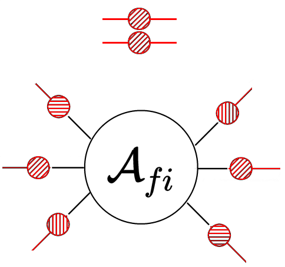
--->

---

<b style="font-variant: small-caps; font-size: xxx-large"> Amplitudes and Cross Sections </b>
 

Amplitudes are a key element for computing cross sections. At hadron colliders, we have:
$$
\displaystyle σ_{2 \rightarrow n - 2} = \sum_{a,b} ∫ dx_a dx_b f_{a/h_1}(x_a, μ_F) \, f_{b/h_2}(x_b, μ_F) \;\hat{σ}_{ab→n-2}(x_a, x_b, μ_F, μ_R) \\[2mm]
\displaystyle \hat{σ}_{n}=\frac{1}{2\hat{s}}\int d\text{LIPS}\;(2π)^4δ^4\big(\sum_{i=1}^n p_i\big)\;|\overline{\mathcal{A}(p_i,\lambda_i,a_i,μ_F, μ_R)}|^2
$$

  

       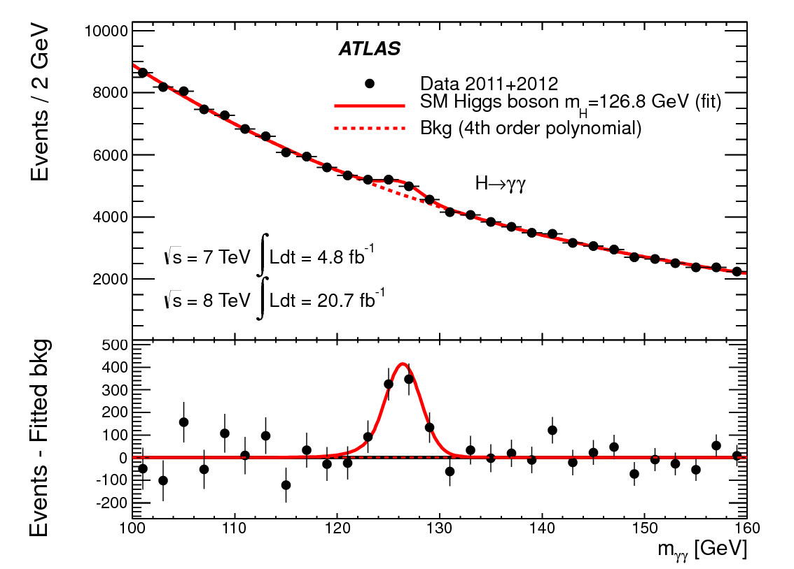
       <a style="font-size: large; text-align: center; float: center; margin-top: -10mm; margin-bottom: 0mm;" href=https://arxiv.org/abs/1207.7214>
       	  ATLAS Collaboration ('12)
       </a>
  

  

       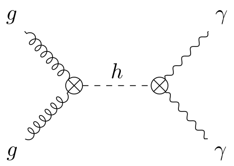
       $$\mathcal{A}_{pp\rightarrow h \rightarrow \gamma\gamma} \sim \frac{1}{m_{\gamma\gamma}^2 - m^2_h + i m_h \Gamma_h}$$
       $$\Rightarrow\; \text{Breit–Wigner distribution}$$
  

---

<b style="font-variant: small-caps; font-size: xxx-large; margin-bottom: -2mm; margin-top: -5mm;"> Perturbation Theory </b>

$$\displaystyle \mathcal{A}_n / \alpha_s^k = \mathcal{A}_n^{\text{tree}} + \underbrace{\left(\frac{\alpha_s}{2\pi}\right) \mathcal{A}_n^{1-\text{loop}}}_{\sim 10\%} + \underbrace{\left(\frac{\alpha_s}{2\pi}\right)^2 \mathcal{A}_n^{2-\text{loop}}}_{\sim 1\%}$$

Better predictions require both more loops and higher multiplicity.

<!---
<table width=50% border="1" cellspacing="0" cellpadding="0" style="margin-bottom: 8mm; margin-top: 8mm">
  <tr class="greenline">
    <td colspan="2", rowspan="2"> 
 
 <b> $\mathcal{A}_{n-gluons}^{\ell-loops} \propto g_s^{n-2+2\ell} $ </b> 
 
 </td>
    <td colspan="4"> 
 multiplicity $(n)$ 
 </td>
  </tr>
  <tr>
    <td><b>4</b></td>
    <td><b>5</b></td>
    <td><b>6</b></td>
    <td><b>7</b></td>
  </tr>
  <tr>
    <td rowspan="3"> 
 loops ($\ell$) 
 </td>
    <td><b>0</b></td>
    <td>2</td>
    <td>3</td>
    <td>4</td>
    <td>5</td>
  </tr>
  <tr>
    <td><b>1</b></td>
    <td>4</td>
    <td>5</td>
    <td>6</td>
    <td>7</td>
  </tr>
  <tr>
    <td><b>2</b></td>
    <td>6</td>
    <td>7</td>
    <td>8</td>
    <td>9</td>
  </tr>
</table>
--->

     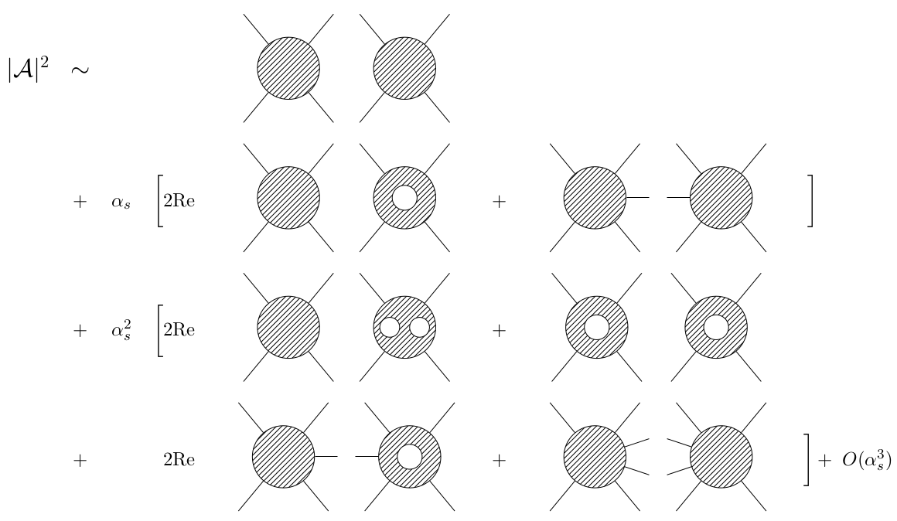

Processes with additional soft or collinear radiation are indistinguishable from the Born.

<!---

More loops $\rightarrow$ analytical complexity; &nbsp more legs $\rightarrow$ algebraic complexity.

--->

---

<b style="font-variant: small-caps; font-size: xxx-large">
   State-of-the-Art
</b>

 

     $\circ\,$ Focus on all-gluon scattering, as a representative example.

 

<table width=60% border="1" cellspacing="0" cellpadding="0" style="margin-bottom: 8mm; margin-top: 2mm; font-size: 16pt;">
  <tr class="greenline">
    <td colspan="2", rowspan="2"> 
 
 <b> $\mathcal{A}_{n-gluons}^{\ell-loops}$ </b> 
 
 </td>
    <td colspan="5"> 
 multiplicity $(n)$ 
 </td>
  </tr>
  <tr>
    <td><b>4</b></td>
    <td><b>5</b></td>
    <td><b>6</b></td>
    <td><b>7</b></td>
    <td><b>8</b></td>
  </tr>
  <tr>
    <td rowspan="4"> 
 loops ($\ell$) 
 </td>
    <td><b>0</b></td>
    <td bgcolor="green"></td>
    <td bgcolor="green"></td>
    <td bgcolor="green"></td>
    <td bgcolor="green"></td>
    <td bgcolor="green"></td>
  </tr>
  <tr>
    <td><b>1</b></td>
    <td bgcolor="green"></td>
    <td bgcolor="green" ></td>
    <td bgcolor="green"></td>
    <td bgcolor="yellow"></td>
    <td bgcolor="yellow"></td>
  </tr>
  <tr>
    <td><b>2</b></td>
    <td bgcolor="green"></td>
    <td bgcolor="99FF00"></td>
    <td bgcolor="red"></td>
    <td bgcolor="red"></td>
    <td bgcolor="red"></td>
  </tr>
  <tr>
    <td><b>3</b></td>
    <td bgcolor="green"></td>
    <td bgcolor="red"></td>
    <td bgcolor="red"></td>
    <td bgcolor="red"></td>
    <td bgcolor="red"></td>
  </tr>
</table>

     $\circ\,$Three-loop four-point (analytic)

<a style="font-size: large; text-align: right; float: right; margin-top: -3mm; margin-bottom: 0mm;" href=https://arxiv.org/abs/2112.11097>
   Caola, Chakraborty, Gambuti, von Manteuffel, Tancredi ('21)
</a>

 

     $\circ\,$Two-loop five-point (analytic)

     &nbsp (Leading Color)

<a style="font-size: large; text-align: right; float: right; margin-top: -3mm; margin-bottom: 0mm;" href=https://arxiv.org/abs/1812.04586>
   Abreu, Dormans, Febres Cordero, Ita, Page ('18)
</a>

 

     $\circ\,$One-loop six-point (analytic)

     &nbsp (Previous results involve taking limits, sqrts, etc..)

<a style="font-size: large; text-align: right; float: right; margin-top: -3mm; margin-bottom: 0mm;" href=https://arxiv.org/abs/1904.04067>
   GDL, Maître ('19)
</a>

 

     $\circ\,$One-loop beyond six-point (solved, but only numerically)

<a style="font-size: large; text-align: right; float: right; margin-top: -3mm; margin-bottom: 0mm;" href=https://arxiv.org/abs/1907.13071>
   OpenLoops,&nbsp$\dots$
</a>
<a style="font-size: large; text-align: right; float: right; margin-top: -3mm; margin-bottom: 0mm;" href=https://arxiv.org/abs/1605.01090>
   Recola,&nbsp
</a>
<a style="font-size: large; text-align: right; float: right; margin-top: -3mm; margin-bottom: 0mm;" href=https://arxiv.org/abs/1312.7140>
   Njet,&nbsp
</a>
<a style="font-size: large; text-align: right; float: right; margin-top: -3mm; margin-bottom: 0mm;" href=https://arxiv.org/abs/1112.3940>
   BlackHat,&nbsp
</a>

 

     $\circ\,$Tree (solved)

<a style="font-size: large; text-align: right; float: right; margin-top: -3mm; margin-bottom: 0mm;" href=https://arxiv.org/abs/1010.3991>
   Dixon, Henn, Plefka, Schuster ('10); $\dots$
</a>
<a style="font-size: large; text-align: right; float: right; margin-top: -3mm; margin-bottom: 0mm;" href=https://arxiv.org/abs/hep-th/0501052>
   Britto, Cachazo, Feng, Witten;&nbsp
</a>
<a style="font-size: large; text-align: right; float: right; margin-top: -3mm; margin-bottom: 0mm;" href=https://www.sciencedirect.com/science/article/abs/pii/0550321388904427>
   Berends, Giele;&nbsp
</a>

</section>

---

<section>



# The structure of   Scattering Amplitudes

<!---
---

<b style="font-variant: small-caps; font-size: xxx-large; margin-bottom: 30mm;"> Dynamics and Kinematics </b>

Color ordering at tree level ($T$'s are $SU(N_c)$ generators)

<a style="font-size: large; text-align: right; float: right; margin-top: 5mm; margin-bottom: 5mm;" href=https://www.sciencedirect.com/science/article/pii/0550321387906043?ref=pdf_download&fr=RR-2&rr=7c49373aad8e3b51>
   Berends, Giele ('80s)
</a>

$$\displaystyle \mathcal{A}^{tree}_{n}({p_i, λ_i, a_i}) = \; g^{n-2} \sum_{σ\in S_n/Z_n} \color{green}{\text{Tr}(T^{a_σ(1)}\dots T^{a_σ(n)})} \; \color{red}{A^{tree}_n(σ(p_1^{λ_1}),\dots ,σ(p_n^{λ_n}))}\\[8mm]$$

and one loop

<a style="font-size: large; text-align: right; float: right; margin-top: 5mm; margin-bottom: 5mm;" href=https://www.sciencedirect.com/science/article/pii/055032139190567H?ref=pdf_download&fr=RR-2&rr=7c4937405f2d3b51>Bern, Kosower ('91)</a>

$$\displaystyle\mathcal{A}^{1-loop}_{n}({p_i, λ_i, a_i}) = \; g^{n} \sum_{σ\in S_n/Z_n} \color{green}{N_{c}\text{Tr}(T^{a_σ(1)}\dots T^{a_σ(n)})} \; \color{red}{A^1_{n;1}(σ(p_1^{λ_1}),\dots ,σ(p_n^{λ_n}))} \\
\displaystyle + \sum_{c = 2}^{\lfloor n/2 \rfloor + 1}\sum_{σ\in S_n/Z_{n;c}} \color{green}{\text{Tr}(T^{a_σ(1)}\dots T^{a_σ(c-1)})\text{Tr}(T^{a_σ( c)}\dots T^{a_σ(n)})} \;  \color{red}{A^1_{n;c}(σ(p_1^{λ_1}),\dots ,σ(p_n^{λ_n}))}$$

We will focus on <i>color-ordered</i> amplitudes $A^\ell_n$

--->

---

 Rational and Transcendental 

     Decomposition in terms of <b> master integrals </b> 

<a style="font-size: large; text-align: right; float: right; margin-bottom: 5mm; margin-top: 5mm" href=https://arxiv.org/abs/0712.1851>Ellis, Zanderighi</a>
<a style="font-size: large; text-align: right; float: right; margin-bottom: 5mm; margin-top: 5mm" href=https://arxiv.org/abs/hep-ph/9212308>Bern, Dixon, Kosower;&nbsp</a>
<a style="font-size: large; text-align: right; float: right; margin-bottom: 5mm; margin-top: 5mm" href=https://www.sciencedirect.com/science/article/pii/0550321379906059?ref=pdf_download&fr=RR-2&rr=7c4afcac1f343b58>'t Hooft, Veltman;&nbsp</a>

 

$$A^{1-\text{loop},D=4}_{n} = \sum_i \color{orange}{d_i} \color{red}{I^i_{Box}} + \sum_i \color{orange}{c_i} \color{red}{I^i_{Triangle}} + \sum_i \color{orange}{b_i} \color{red}{I^i_{Bubble}} + \sum_i \color{orange}{a_i} \color{red}{I^i_{Tadpoles}} + \color{orange}{R}$$

       

     In general, in $D= 4- 2 \epsilon$, for a suitable choice of master integrals 

  

$$ A^{\ell-loop}_n = \sum_{i \in \text{masters}} \frac{\color{orange}{c_i}(\vec p, \vec \lambda, \epsilon) \, \color{red}{I_i}(\vec p, \epsilon)}{\prod_j (\epsilon - a_{ij})}\;, \quad \text{with} \quad a_{ij} \in \mathbb{Q}$$

<!---

    $\kern30mm \cdot$ the coefficients $c_i$ are rational in $p_i$ and polynomial in $\epsilon$,  
    $\kern30mm \cdot$ the master integrals $I_i$ are transcendental,  
    $\kern30mm \cdot$ the $a_{ij}$ are rational numbers ($a_{ij} \in \mathbb{Q}$)

--->

---

<b style="font-variant: small-caps; font-size: xxx-large"> 
Feynman diagram by Feynman diagram 
</b>

 

     
     $\circ\,$ Analytic computations can get very complicated very quickly. For example, for $A^{\text{tree}}_{5-\text{gluons}}$:

 

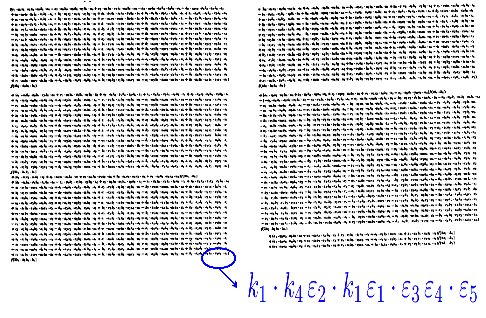

 

<!---

     
     $(k_1 \cdot k_4) (\varepsilon_2 \cdot k_2) (\varepsilon_1 \cdot \varepsilon_3) (\varepsilon_4 \cdot \varepsilon_5)$

     $\phantom{\circ}\,$ with $k_i$ 4-momenta, and $\varepsilon_i$ polarization tensors.   
     $\circ\,$ This is for a tree-level 5-gluon amplitude, which can be simplified to

--->

     $\circ\,$This amplitude can be written as just

<a style="font-size: large; text-align: right; float: right; margin-top: 0mm; margin-bottom: 0mm;" href=https://www.sciencedirect.com/science/article/pii/0550321388904427>
   Berends, Giele ('88)
</a>
<a style="font-size: large; text-align: right; float: right; margin-top: 0mm; margin-bottom: 0mm;" href=https://journals.aps.org/prl/pdf/10.1103/PhysRevLett.56.2459>
   Parke, Taylor ('86),&nbsp
</a>

 

$|A^{tree}(1^{+}_{g}2^{+}_{g}3^{+}_{g}4^{-}_{g}5^{-}_{g})|^2 = \frac{s_{45}^{4}}{s_{12}s_{23}s_{34}s_{45}s_{51}}$

<!---
---

<b style="font-variant: small-caps; font-size: xxx-large"> Spinor Helicity Basics </b>
 

     $\circ\,$ The spinors $\lambda, \bar\lambda$ can be expressed in terms of 4-momentum components as:

$$
\lambda\_\alpha=\frac{1}{\sqrt{p^0+p^3}}\begin{pmatrix}p^0+p^3 \\\ p^1+ip^2\end{pmatrix} \, , \;\;
\bar\lambda\_{\dot\alpha}=\frac{1}{\sqrt{p^0+p^3}}\begin{pmatrix}p^0+p^3 \\\ p^1-ip^2\end{pmatrix} 
$$

     $\circ\,$ Indices are raised with the metric $\epsilon^{\alpha\beta}=\epsilon^{\dot\alpha\dot\beta}$, which is the Levi-Civita symbol.

     $\circ\,$ Lorentz-invariant <i> spinor brackets </i> are built by contracting the Lorentz-covariant spinor

$$
⟨ij⟩ = λ_iλ_j = (λ_i)^α(λ_j)_α \quad \quad \quad [ij] = \barλ_i\barλ_j = (\barλ_i)\_\dotα(\barλ_j)^\dotα
$$

--->

</section>

---

<section>



# How do we compute Scattering Amplitudes efficiently?

<!---
---

<b style="font-variant: small-caps; font-size: xxx-large"> Recursion Relations for Trees </b>

$\circ$ Off-mass-shell recursion for tree (Berends-Giele)

$\circ$ On-mass-shell recursion for tree (Britto-Chacazo-Feng-Witten)

--->

---

<b style="font-variant: small-caps; font-size: xxx-large"> Multi-Loop Amplitudes from Trees </b>

$\circ$ Generalized unitarity relates products of tree amplitudes to loop amplitudes

	

	     $$
	     \require{color}
	     \displaystyle \prod_{\text{trees}} A^{\text{tree}}(\vec k, \vec\ell|_{\text{cut}}) = \sum_{\substack{\text{topologies}\, \Gamma, \\ i \in M_\Gamma \cup S_\Gamma}} \colorbox{yellow}{$c_{i,\Gamma}(\vec k)$} \left( \frac{m_{i,\Gamma}(\vec k, \vec\ell|_{\text{cut}})}{\displaystyle \prod_{\text{props}\,j} \rho_{j}(\vec k, \vec\ell|_{\text{cut}})} \right)
	     $$
	     $$
	     \left. \begin{aligned}
	     \underline{\text{Master integrals}}: \; & \int d^{D}\vec \ell \; \frac{m_{i\in M_\Gamma}}{\small \prod_j \rho_j} \neq 0 \\
	     \underline{\text{Surface terms}}: \; & \int d^{D}\vec \ell \; \frac{m_{i\in S_\Gamma}}{\small \prod_j \rho_j} = 0 \\
	     \end{aligned} \right\} \; \begin{aligned} & \text{Complex} \\ & \text{problem!} \end{aligned}
	     $$
	

	

	     

	     	  <tt> C++ code </tt>
	     
 
	     
	      
	     <a style="font-size: large; text-align: center; float: center; margin-top: -10mm; margin-bottom: 5mm;"
	     	href=https://arxiv.org/abs/2009.11957>
		
 Abreu, Dormans, Febres Cordero, Ita 

		
 Kraus, Page, Pascual, Ruf, Sotnikov ('20) 

	     </a>
	

        

	

	     $\circ$ The diagram on the right shows as example a one-loop box coefficient.   
     	     $\circ$ In general, need to solve linear systems for the coefficients $c_{i,\Gamma}$.  
	

	

	     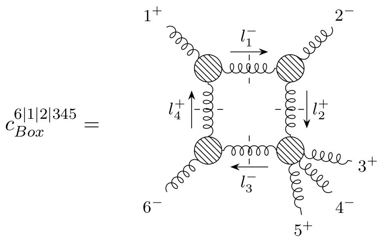
	

---

<b style="font-variant: small-caps; font-size: xxx-large"> Analytics from Numerics </b>

    Problem: direct analytic computation of the $c_{i,\Gamma}$ is not feasible.

     
     $\circ\,$ Floating-point evaluations ($\mathbb{R}$ or $\mathbb{C}$) would be sufficient for phenomenology.  
     $\phantom{\circ}\,$ But they are so unstable, even this won't work.

    
     $\circ\,$ Could try rational inputs ($\mathbb{Q}$), but integers grow way too large at intermediate stages.

     $\circ\,$  Finite fields  ($\mathbb{F}_p$) come to the rescue.  

<a style="font-size: large; text-align: right; float: right; margin-top: 5mm; margin-bottom: 0mm;" href=https://arxiv.org/abs/1608.01902>
   Peraro ('16)
</a>
<a style="font-size: large; text-align: right; float: right; margin-top: 5mm; margin-bottom: 0mm;" href=https://arxiv.org/abs/1406.4513>
   von Manteuffel, Schabinger ('14),&nbsp
</a>

     $\phantom{\circ}\,$ These are integers modulo a prime number $p$ (no precision issue!):  

 $\phantom{\circ}\,$ $\mathbb{F}_p = \{0, 1, 2, \dots, p-1\} \quad \text{with operations} \quad \{+, -, \times, \div \}$

     $\phantom{\circ}\,$ The prime $p$ needs to be large, to avoid accidental <tt> DivisionByZero </tt>.

     $\circ\,$ But we can't do phenomenology with $\mathbb{F}_p$ !   

    Solution: sample $c_{i,\Gamma}$ in $\mathbb{F}_p$ $\;\Rightarrow\;$ reconstruct analytic expression for $c_{i,\Gamma}$

---

<b style="font-variant: small-caps; font-size: xxx-large"> Finite Fields </b>

     
     $\circ\,$ Any rational number, other than multiples of $1/p$, has an equivalent in the finite field $\mathbb{F}_p$.

 

     $\circ\,$ For example, let's work with $p=7$, i.e. with $\mathbb{F}_7 = \{0, 1, 2, 3, 4, 5, 6\}$:

 

     $-1$ is the additive inverse of 1

     $\Rightarrow \quad -1=6$ in $\mathbb{F}_7$, because $1+6 = 7 \, \% \, 7 = 0$

     $\frac{1}{3}$ is the multiplicative inverse of 3

     $\Rightarrow \quad \frac{1}{3}=5$ in $\mathbb{F}_7$, because $3 \times 5 = 15 \, \% \, 7= 1$

     $\phantom{\circ}\,$ The <i>Euclidean algorithm</i> allows to compute inverses without checking every entry.

     $\circ\,$ Numbers cannot grow out of control!

     $\frac{14611884945785561885978841755360860231120837652831038320107}{1853742276676202006476394341472012983521981235200}=1251868773$ in $\mathbb{F}_{2147483647}$

     $\phantom{\circ}\,$ $2147483647$ is $(2^{31}-1)$ which is the largest possible value $p$ working with 32-bits.

</section>

---

<section>



# Analytic Reconstruction

---

<b style="font-variant: small-caps; font-size: xxx-large"> Common-Denominator Ansatz </b>
 

<!---

$\circ\,$ In least-common-denominator (LCD) form, we have

--->

    $\displaystyle c_{i,\Gamma}(\vec x) = \frac{\text{Num. poly}(\vec x)}{\text{Denom. poly}(\vec x)} = \frac{\text{Num. poly}(\vec x)}{\prod_j W_j(\vec x)}$

     $\circ\,$ Interpolation in one variable (continued fraction)

<a style="font-size: large; text-align: right; float: right; margin-top: 5mm; margin-bottom: 0mm;" href=https://en.wikipedia.org/wiki/Thiele%27s_interpolation_formula>
   Thiele (1909)
</a>
  

$c_{i,\Gamma}(t) = c_{i,\Gamma}(t_0) + \frac{t-t_0}{\frac{t_0 - t_1}{c_{i,\Gamma}(t_0)-c_{i,\Gamma}(t_1)}+\frac{t-t_2}{\dots + \frac{t-t_3}{\dots}}} = \frac{\text{Num. poly}(t)}{\text{Denom. poly}(t)}$

$\phantom{\circ}\,$ Match denominator factors of $c_{i,\Gamma}(t)$ to $W_j(t)$ $\Rightarrow$ obtain the denominator (this is the easy part).

$\circ\,$ The numerator is <b> much </b> more complicated, in general

<a style="font-size: large; text-align: right; float: right; margin-top: -6mm; margin-bottom: 0mm;" href=https://arxiv.org/abs/1904.04067>
   For spinors: GDL, Maître (2019)
</a>
 

$\displaystyle \text{Num. poly}(\vec x) = \sum_{\vec \alpha} c_{\vec\alpha} \; x_1^{\alpha_1} \dots x_{m}^{\alpha_{m}}$

     $\circ\,$ To solve the system must sample as many times as there are undertermined $c_{\vec\alpha}$'s.

---

<b style="font-variant: small-caps; font-size: xxx-large"> Tools of the Trade </b>
 

$\circ\,$ In practice, using spinors $m = n(n-1)$ and there are constraints on $\vec \alpha$

	

	     Gröbner bases $\rightarrow$ constrain $\vec\alpha$
	       
	     <a style="font-size: large; text-align: center; float: center; margin-top: -10mm; margin-bottom: 5mm;"
	     href=https://www.singular.uni-kl.de/index.php.html>
		Decker, Greuel, Pfister, Schönemann
	     </a>	    
	

	

	     Integer programming $\rightarrow$ enumerate sols. $\vec\alpha$  
	       
	     <a style="font-size: large; text-align: center; float: center; margin-top: -10mm; margin-bottom: 5mm;"
	     href=https://www.singular.uni-kl.de/index.php.html>
		Perron and Furnon (Google optimization team)
	     </a>
	

     

$\circ\,$ Solving linear systems with CUDA in $\mathbb{C}$ or $\mathbb{F}_{p\leq 2^{31}-1}$ (currently private code)

	

	     <table>
	     <tr>
	     <th style="text-align:center">System Size</th>
	     <th style="text-align:center">Timing</th>
	     </tr>
	     <tr>
	     <td style="text-align:center">8192</td>
	     <td style="text-align:center">8 s</td>
	     </tr>
	     <tr>
	     <td style="text-align:center">16384</td>
	     <td style="text-align:center">51 s</td>
	     </tr>
	     <tr>
	     <td style="text-align:center">32768</td>
	     <td style="text-align:center">6m 30s</td>
	     </tr>
	     </table>
	

	

	     

		with RTX 2080ti 11GB   
		the absolute maximum is 52440 unknowns
	     

	      
	     (thanks gpu-Merlin!)
	     <!---  --->
	

---

<b style="font-variant: small-caps; font-size: xxx-large"> Taming the Algebraic Complexity </b>
 

    Problem: the least-common-denominator form is overly complex.  
    Its numerator can easily exceed <u>1 million</u> monomials (e.g. 5-point 1-mass processes).

$\circ\,$ For example, taking homogeneous expressions in 5 variables

$\displaystyle c_{i,\Gamma}(x_1, \dots, x_5) = \frac{\text{126 monomials of degree 5}}{x_1x_2x_3x_4x_5}$  

$\phantom{\circ\,}$ but say we knew that $x_1x_2$ don't appear in the same denominator as the others, then

$\displaystyle c_{i,\Gamma}(x_1, \dots, x_5) = \frac{\text{15 monomials of degree 2}}{x_1x_2}+\frac{\text{35 monomials of degree 3}}{x_3x_4x_5}$

    Goal: use partial-fraction decompositions,  
    but how to achieve this without an analytic expression?

</section>

---

<section>



    

# The Geometry of Phase Space

    

based on: [GDL, Page (JHEP 12 (2022) 140)](https://arxiv.org/abs/2203.04269)

---

<b style="font-variant: small-caps; font-size: xxx-large"> Least Common Denominator Redux </b>

$\circ\,$ Can't draw pictures in high (complex) dimensions, so let's consider the simplified case $\mathbb{R}[x, y, z]$.

$\circ\,$ Denominator factors $W_j$ correspond to <i> singular surfaces </i>.

	

	     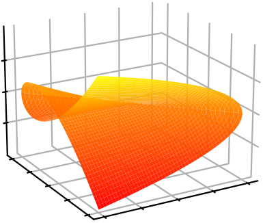  
	     ${\color{orange}W_1 = (xy^2 + y^3 - z^2)}$
	

	

	     Say we have:
	

	

	     $W_1 = xy^2 + y^3 - z^2$  
	

	

	     A function $c_i(x,y,z)$ may or may not have $W_1$ as a pole, depending on what happens on the orange surface
	

	

	     $\displaystyle \lim_{W_j \rightarrow \epsilon} c_i(x,y,z) \sim \frac{1}{\epsilon^{q_{ij}}} $
	

        

    The LCD tells us about what happens on surfaces with one less dimension than the full space.

---

<b style="font-variant: small-caps; font-size: xxx-large"> Multivariate Partial Fractions </b>

$\circ\,$ To distinguish $\displaystyle \frac{1}{W_1W_2}$ from $\displaystyle \frac{1}{W_1} + \frac{1}{W_2}$, look at $W_1 \sim W_2 \rightarrow \epsilon \ll 1$. Geometrically:

	

	       
	     ${\color{orange}W_1 = (xy^2 + y^3 - z^2)}$
	

	

	     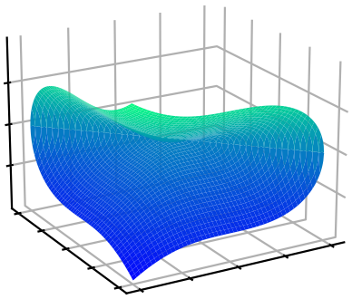  
	     ${\color{blue}W_2 = (x^3 + y^3 - z^2)}$
	

	

	     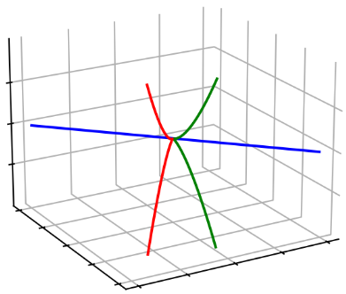  
	     $V(W_1) \cap V(W_2)$
	

$\circ\,$ <i> Primary decompositions </i> of sets of polynomials (<i> ideals </i>), anogous to integers:

	

	     $60 = 5 \times 3 \times 2^2$
	

	

	     $({\color{orange}xy^2 + y^3 - z^2}, {\color{blue}x^3 + y^3 - z^2}) = \\
	     {\color{magenta}(z^2,x+y)} \cup {\color{green}(y^3-z^2,x)} \cup {\color{red}(2y^3-z^2,x-y)}$
	

    Partial-fraction decompositions tell us about the relations between poles.

</section>

---

<section>

<b style="font-variant: small-caps; font-size: xxx-large; margin-bottom: 5mm;">
   Upcoming Results
</b>

$\circ\,$ First two-loop computation in full color ($N_c$ dependence) for $q\bar q \rightarrow \gamma \gamma \gamma$  

<table width=110% border="1" cellspacing="0" cellpadding="0" style="margin-left: -12mm; margin-bottom: 8mm; margin-top: 8mm; font-size: x-large;">
  <tr>
    <td><b>Kinematics</b></td>
    <td><b># Poles ($W$)</b></td>
    <td><b>LCD Ansatz</b></td>
    <td><b>Partial-Fraction Ansatz</b></td>
    <td><b>Rational Functions</b></td>
  </tr>
  <tr>
    <td style="text-align: center;">5-point massless</td>
    <td style="text-align: center;">30</td>
    <td style="text-align: center;">29k</td>
    <td style="text-align: center;">4k</td>
    <td style="text-align: center;">$\sim$200 KB</td>
  </tr>
</table>

$\circ\,$ Updated two-loop leading-color amplitudes for $pp \rightarrow Wjj$, now in spinor helicity

<table width=100% border="1" cellspacing="0" cellpadding="0" style="margin-bottom: 8mm; margin-top: 8mm; font-size: x-large;">
  <tr>
    <td><b>Kinematics</b></td>
    <td><b># Poles ($W$)</b></td>
    <td><b>LCD Ansatz</b></td>
    <td><b>Partial-Fraction Ansatz</b></td>
    <td><b>Rational Functions</b></td>
  </tr>
  <tr>
    <td style="text-align: center;">5-point 1-mass</td>
    <td style="text-align: center;">>200</td>
    <td style="text-align: center;">>5M</td>
    <td style="text-align: center;">$\sim$40k</td>
    <td style="text-align: center;">$\sim$25 MB</td>
  </tr>
</table>

$\phantom{\circ\,}$ First computed in
<a  href=https://arxiv.org/abs/2110.07541>
Abreu, Febres Cordero, Ita, Klinkert, Page, Sotnikov
</a> (1.2 GB)

---

<b style="font-variant: small-caps; font-size: xxx-large"> Try it yourself </b>

<code style="font-size: xx-large">
pip install <a href="https://github.com/GDeLaurentis/lips">lips</a> <a href="https://github.com/GDeLaurentis/pyadic">pyadic</a>
</code>

  

<b style="font-variant: small-caps; font-size: xxx-large"> Thanks for your attention! </b>

 

<b> Questions? </b>

</section>

---

<section data-visibility="uncounted">

# Backup Slides

</section>

---

<section data-visibility="uncounted">

# Absolute Values   on the Rationals

---

<b style="font-variant: small-caps; font-size: xxx-large"> $\boldsymbol p\\,$-adic Numbers </b>

     
     $\circ\,$ We have again a problem <b> in a finite field </b> 1 is not smaller than 2. In fact:

  

     
     $|x = 0|_{\mathbb{F}_p} = 0 \quad \text{and} \quad |x \neq 0|_{\mathbb{F}_p} = 1$

     
     $\phantom{\circ}\,$ Can't easily take limits, without dividing by zero.

 

    $\circ\,$ A $p$-adic number $x \in \mathbb{Q}_p$ is Laurent expansion in powers of the prime $p$

     
     $x = a_{\nu_p} p^{\nu_p} + \dots + a_{-1}p^{-1} + a_{0} p^{0} + a_1 p^1 + \dots $

    $\circ\,$ The $p$-adic absolute value is defined as (note the minus sign!)

     
     $|x|_{\mathbb{Q}_p} = p^{-\nu_p} \quad \Rightarrow \quad |p|_{\mathbb{Q}_p} < |1|_{\mathbb{Q}_p} < |\frac{1}{p}|_{\mathbb{Q}_p}$

    Retain integer arithmetics, while restoring the ability to take limits!

</section>

---

<section data-visibility="uncounted">

# Python Packages

---

<b style="font-variant: small-caps; font-size: xxx-large"> pyAdic </b>

     $\circ\,$ <tt>Pyadic</tt> provides flexible number types for finite fields and $p$-adic numbers in Python.   Related algorithms, such as rational reconstruction are also implemented.

<pre><code class="language-python" style="text-align: left; font-size: large; float: left; width: 100%; margin-left: -10mm;"> from pyadic import ModP
 from fractions import Fraction as Q
 ModP(Q(7, 13), 2147483647)
 <<< 1817101548 % 2147483647
 # Can also go back to rationals
 from pyadic.finite_field import rationalise
 rationalise(ModP(Q(7, 13), 2147483647))
 <<< Fraction(7, 13)
</code></pre>

---

<b style="font-variant: small-caps; font-size: xxx-large"> Lips </b>

     $\circ\,$ <tt>Lips</tt> is a phase-space generator and manipulator for 4-dimensional kinematics in any field, $\mathbb{C}, \mathbb{F}_p, \mathbb{Q}_p, \mathbb{Q}[i]$. It is particularly useful for spinor-helicity computations.

<pre><code class="language-python" style="text-align: left; font-size: large; float: left; width: 100%; margin-left: -10mm;"> from lips import Particles
 from lips.fields.field import Field
 # Random finite field phase space point, arbitrary multiplicity
 multiplicity = 5
 PSP = Particles(multiplicity, field=Field("finite field", 2 ** 31 - 1, 1), seed=0)
 # Evaluate an arbitrary complicated expression
 PSP("(8/3s23⟨24⟩[34])/(⟨15⟩⟨34⟩⟨45⟩⟨4|1+5|4])")
 <<< 683666045 % 2147483647
</code></pre>

     $\circ\,$ It can also be used to generate points in singular configuration.

</section>

---

<section data-visibility="uncounted">

# Spinor Helicity

---

<b style="font-variant: small-caps; font-size: xxx-large">  Representations of the Lorentz group </b>

(Recall: $\mathfrak{so}(1, 3)_\mathbb{C} \sim \mathfrak{su}(2) \times \mathfrak{su}(2)$)
 

<table>
  <thead>
    <tr>
      <th>$(j_{-},j_{+})$</th>
      <th>dim.</th>
      <th>name</th>
      <th>quantum field</th>
      <th>kinematic variable</th>
    </tr>
  </thead>
  <tbody>
    <tr>
      <td>(0,0)</td>
      <td>1</td>
      <td>scalar</td>
      <td>$h$</td>
      <td>m</td>
    </tr>
    <tr>
      <td>(0,1/2)</td>
      <td>2</td>
      <td>right-handed Weyl spinor</td>
      <td>$\chi_{R\,\alpha}$</td>
      <td>$\lambda_\alpha$</td>
    </tr>
    <tr>
      <td>(1/2,0)</td>
      <td>2</td>
      <td>left-handed Weyl spinor</td>
      <td>$\chi_L^{\,\dot\alpha}$</td>
      <td>$\bar{\lambda}^{\dot\alpha}$</td>
    </tr>
    <tr>
      <td>(1/2,1/2)</td>
      <td>4</td>
      <td>rank-two spinor/four vector</td>
      <td>$A^\mu/A^{\dot\alpha\alpha}$</td>
      <td>$P^\mu/P^{\dot\alpha\alpha}$</td>
    </tr>
    <tr>
      <td>(1/2,0)$\oplus$(0,1/2)</td>
      <td>4</td>
      <td>bispinor (Dirac spinor)</td>
      <td>$\Psi$</td>
      <td>$u, v$</td>
    </tr>
  </tbody>
</table>

---

<b style="font-variant: small-caps; font-size: xxx-large">  Spinor Covariants </b>
 

Weyl spinors are sufficient for massless particles:

$\text{det}(P^{\dot\alpha\alpha})=m^2 \rightarrow 0 \quad \Longrightarrow \quad P^{\dot\alpha\alpha} = \bar\lambda^{\dot\alpha}\lambda^\alpha$.

 

In terms of 4-momentum components we have:

$$
\lambda\_\alpha=\frac{1}{\sqrt{p^0+p^3}}\begin{pmatrix}p^0+p^3 \\\ p^1+ip^2\end{pmatrix} \, , \;\;\; \lambda^\alpha=\epsilon^{\alpha\beta} \lambda_\beta =\frac{1}{\sqrt{p^0+p^3}}\begin{pmatrix}p^1+ip^2 \\\ -p^0+p^3\end{pmatrix}
$$

$\bar\lambda\_{\dot\alpha}=\frac{1}{\sqrt{p^0+p^3}}\begin{pmatrix}p^0+p^3 \\\ p^1-ip^2\end{pmatrix} \, , \;\;\; \bar\lambda^{\dot\alpha}=\epsilon^{\dot\alpha\dot\beta}\bar\lambda_{\dot\beta}=\frac{1}{\sqrt{p^0+p^3}}\begin{pmatrix}p^1-ip^2 \\\ \-p^0+p^3\end{pmatrix}$

 

$$
\bar\lambda\_{\dot\alpha} = (\lambda\_\alpha)^* \quad if \quad p^i \in \mathbb{R}; \quad \quad \bar\lambda\_{\dot\alpha} \neq (\lambda\_\alpha)^* \quad if \quad p^i \in \mathbb{C}
$$

---

<b style="font-variant: small-caps; font-size: xxx-large">  Spinor Invariants </b>
 

$$
⟨ij⟩ = λ_iλ_j = (λ_i)^α(λ_j)_α \quad \quad \quad [ij] = \barλ_i\barλ_j = (\barλ_i)\_\dotα(\barλ_j)^\dotα
$$
$$
s_{ij} = ⟨ij⟩[ji]
$$
$$
⟨i\;|\;(j+k)\;|\;l] = (λ_i)^α (\not P_j + \not P_k )\_{α\dotα} \barλ_l^\dotα
$$
$$
⟨i\;|\;(j+k)\;|\;(l+m)\;|\;n⟩ = (λ_i)^α (\not P_j + \not P_k )\_{α \dot α} (\bar{\not P_l} + \bar{\not P_m} )^{\dot α α} (λ_n)_α
$$
$$
tr_5(ijkl) = tr(\gamma^5 \not P_i \not P_j \not P_k \not P_l) =  [i\,|\,j\,|\,k\,|\,l\,|\,i⟩ - ⟨i\,|\,j\,|\,k\,|\,l\,|\,i]
$$

</section>

---

<section data-visibility="uncounted">

# Five-Parton Two-Loop   Finite Remainders

 

Example Simplifications

---

<b> uubggg pmpmp Nf1 #3 </b>

 
is equal to 

$
-\frac{[32]^3 [41]^3}{2 [31]^3 [42]^3}
$

---

<b> ggggg mpmpp Nf1 # 9 </b>

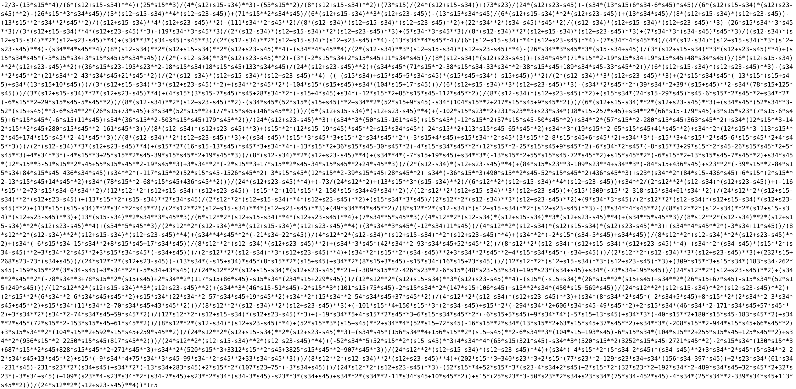

 

 
is equal to 

 

$-1\frac{[12]³[15][23]⟨25⟩³[35]³}{[13]⁴[25]⟨5|1+2|5]³}+\frac{97}{12}\frac{[12]⁴⟨25⟩[35]⁴}{[13]⁴[25]³⟨5|1+2|5]}$
$+\frac{13}{3}\frac{[12]⁴⟨15⟩[15][35]⁴}{[13]⁴[25]⁴⟨5|1+2|5]}+\frac{1}{4}\frac{[12]⁴⟨15⟩[15]⟨25⟩[35]⁴}{[13]⁴[25]³⟨5|1+2|5]²}$
$-\frac{3}{2}\frac{[12]²⟨25⟩²[25][35]²}{[13]²[25]⟨5|1+2|5]²}+\frac{7}{4}\frac{[12]³⟨25⟩²[35]³}{[13]³[25]⟨5|1+2|5]²}$
$-\frac{43}{3}\frac{[12]³⟨25⟩[35]³}{[13]³[25]²⟨5|1+2|5]}$
$-\frac{25}{3}\frac{[12]³⟨15⟩[15][35]³}{[13]³[25]³⟨5|1+2|5]}$
$-\frac{3}{2}\frac{[12]⟨25⟩[25][35]}{[13][25]⟨5|1+2|5]}$
$+4\frac{[12]²⟨25⟩[35]²}{[13]²[25]⟨5|1+2|5]}$
$-\frac{15}{2}\frac{[12]²[35]²}{[13]²[25]²}$
$+\frac{7}{2}\frac{[12][35]}{[13][25]}$
$-\frac{2}{3}$

</section>

---

<section data-visibility="uncounted">

# Higgs + 4-Parton Amplitude   (@ finite top-mass) 

---

<b> Example of cut diagram </b>

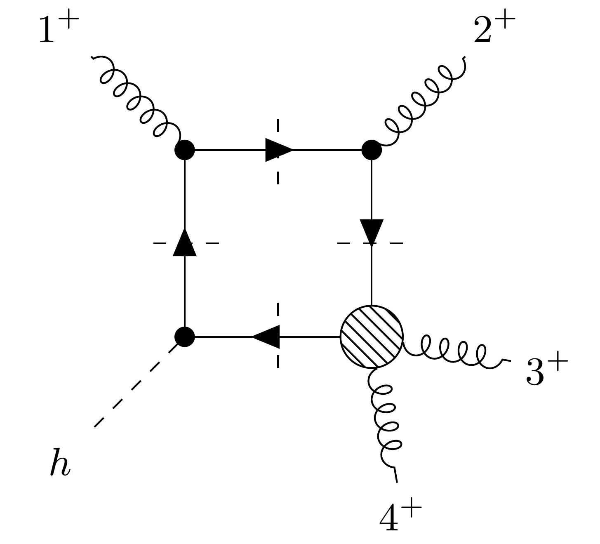

Only singularity involving $m_{top}$ (from pentagon contributions)

$16 |S\_{1×2×3×4}| = −s\_{12} \, s\_{23} \, s\_{34} \, \langle 1 |2 + 3|4] \, \langle 4|2 + 3|1] + m^2\_{top} \, tr_5(1234)^2$

We can generate point near this singularity in a similar fashion.

---

<b> Structure of the coefficients </b>

The massive external leg (the Higgs) is easily accomodated by considering it as a pair of massless particles (think decay products).  
In the end all dependance on $P_{Higgs}$ is removed by using momentum conservation.

The coefficients are Taylor expasions in $m_{top}$:

$C^{(0)} + m^2_{top} C^{(2)}$.

with $C^{(0)}$ and $C^{(2)}$ resabling the six-gluon coefficients.

</section>

<!-- REVEAL.JS CUSTOMIZATION -->

<!-- Include MathJax library -->

<!-- Include Reveal.js and the Math plugin -->

<!-- Initialize Reveal.js with the MathJax plugin -->

