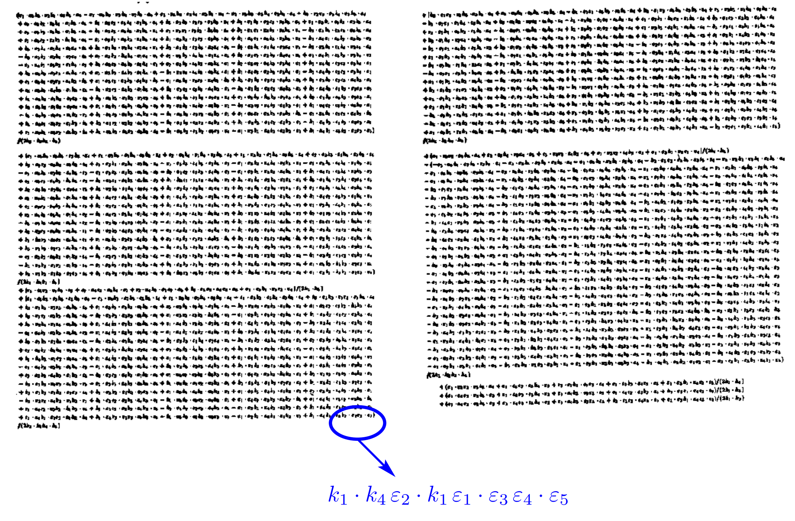



### Analytical &nbsp; amplitudes &nbsp; from &nbsp; numerical &nbsp; evaluations

<br>
Giuseppe De Laurentis

with Daniel Maitre

<br>

IPPP - Durham University

 


- Only the speaker can read these notes
- Press `S` key to view


---

### Table of Contents

<br>

*1. Motivation and introduction*

*2. Singularity structure*

*3. Analytical amplitude extraction*

*4. Some results (Yang-Mills in the Standard Model)*

---

<section>

### 1.1 Motivation

---

<font size=6>Cross sections at hadron colliders are given by:</font size>


<font size=5>
$σ_{2 \rightarrow n - 2} = ∑\_{a,b} ∫ dx_a dx_b f\_{a/h_1}(x_a, μ_F) \, f\_{b/h_2}(x_b, μ_F) \;\hat{σ}\_{ab→n-2}(μ_F, μ_R)$

$d\hat{σ}\_{n}=\frac{1}{2\hat{s}}dΠ\_{n-2}\;(2π)^4δ^4\big(∑\_{i=1}^n p_i\big)\;|\overline{\mathcal{A}(p_i,μ_F, μ_R)}|^2$
</font size>

<font size=6>Better predictions requires more loops and higher multiplicity. <br> The table shows the powers of the coupling:</font size>

<font size=5>

<table width=50% border="1" cellspacing="0" cellpadding="0">
  <tr class="greenline">
    <td colspan="2", rowspan="2"> <div id="rot90"> <center> <b> $\mathcal{A}_m^l \propto g_s^n $ </b> </center> </div> </td>
    <td colspan="4"> <center> <b> multiplicity </b> </center> </td>
  </tr>
  <tr>
    <td><b>4</b></td>
    <td><b>5</b></td>
    <td><b>6</b></td>
    <td><b>7</b></td>
  </tr>
  <tr>
    <td rowspan="3"> <b> loops </b> </td>
    <td><b>0</b></td>
    <td>2</td>
    <td>3</td>
    <td>4</td>
    <td>5</td>
  </tr>
  <tr>
    <td><b>1</b></td>
    <td>4</td>
    <td>5</td>
    <td>6</td>
    <td>7</td>
  </tr>
  <tr>
    <td><b>2</b></td>
    <td>6</td>
    <td>7</td>
    <td>8</td>
    <td>9</td>
  </tr>
</table>

</font size>

---

<font size=6>Brute force calculations are a mess:</font size>



<font size=6>Results are often much easier [[1](https://journals.aps.org/prl/pdf/10.1103/PhysRevLett.56.2459),
[2](https://reader.elsevier.com/reader/sd/pii/0550321388904427?token=EFDF378B5E170FFAF0B1BECE184A1EB6304F7798C481CF3C0E7D93DF6D367AE0E093D4D4942C932C66E8BEB75DAB41FE)]:</font size>


<font size=5>

$$A^{tree}(1^{+}\_{g}2^{+}\_{g}3^{+}\_{g}4^{-}\_{g}5^{-}\_{g}) = \frac{i\,⟨45⟩^{4}}{⟨12⟩⟨23⟩⟨34⟩⟨45⟩⟨51⟩}$$

</font size>

</section>
---
---

<section>
### 1.2 Color Ordering

---

<font size=6>Relation to the full amplitude @ tree level:</font size>

<font size=5>$\mathcal{A}^{tree}\_{n}({p_i, λ_i, a_i}) = \; g^{n-2} ∑\_{σ\in S_n/Z_n} \text{Tr}(T^{a_σ(1)}\dots T^{a_σ(n)}) A^{tree}_n(σ(1^{λ_1}),\dots ,σ(n^{λ_n})).$</font size>

<font size=6>Color decomposition at one loop:</font size>

<font size=5>
$\mathcal{A}^{1-loop}\_{n}({p\_i, λ\_i, a\_i}) = \; g^{n} ∑\_{σ\in S\_n/Z\_n} N\_{c} \text{Tr}(T^{a\_σ(1)}\dots T^{a\_σ(n)}) A\_{n;1}(σ(1^{λ\_1}),\dots ,σ(n^{λ\_n}))$
$ + ∑\_{c = 2}^{\lfloor n/2 \rfloor + 1}∑\_{σ\in S\_n/Z\_{n;c}} \text{Tr}(T^{a\_σ(1)}\dots T^{a\_σ(c-1)})\text{Tr}(T^{a\_σ( c)}\dots T^{a\_σ(n)}) A\_{n;c}(σ(1^{λ\_1}),\dots ,σ(n^{λ\_n}))$</font size>
</font size>

<font size=6>Decomposition in terms of basis integrals:</font size>

<font size=5>
$$A^{1-loop}\_{n;1} = \sum\_i d\_i I^i\_{Box} + \sum\_i c\_i I^i\_{Triangle} + \sum\_i b\_i I^i\_{Bubble} + R$$
</font size>

</section>
---
---

<section>
### 1.3 Spinor Helicity

---

<font size=6> The lowest-laying representations of the Lorentz group</font size>
<font size=5> $\mathfrak{so}(1, 3)_\mathbb{C} \sim \mathfrak{su}(2) \times \mathfrak{su}(2)$</font size> 

<font size=5>

| $\boldsymbol{(j\_{-},j\_{+})}$ | dim. | name | quantum field | kinematic variable |
| :-------------: | :-------------: | :------------- | :-------------: | :-------------: |
| (0,0) | 1 | scalar | $h$ | m |
| (0,1/2) | 2 | right-handed Weyl spinor | $\chi_{R\,\alpha}$ | $\lambda_\alpha$ |
| (1/2,0) | 2 | left-handed Weyl spinor | $\chi_L^{\,\dot\alpha}$ | $\bar{\lambda}^{\dot\alpha}$ |
| (1/2, 1/2) | 4 | rank-two spinor/four vector | $A^\mu/A^{\dot\alpha\alpha}$ | $P^\mu/P^{\dot\alpha\alpha}$ |
| (1/2,0)$\oplus$(0,1/2) | 4 | bispinor (Dirac spinor) | $\Psi$ | $u, v$ |

</font size>

---

<font size=6>Weyl spinors are sufficient for massless particles:</font size>

<font size=5>

$\text{det}(P^{\dot\alpha\alpha})=m^2 \rightarrow 0 \quad \Longrightarrow \quad P^{\dot\alpha\alpha} = \bar\lambda^{\dot\alpha}\lambda^\alpha$

</font size>

<font size=6>where:</font size>

<font size=5>

$$
\lambda\_\alpha=\begin{pmatrix}\sqrt{p^0+p^3} \\\ \frac{p^1+ip^2}{\sqrt{p^0+p^3}}\end{pmatrix} \, , \;\;\; \lambda^\alpha=\epsilon^{\alpha\beta} \lambda_\beta =\begin{pmatrix}\frac{p^1+ip^2}{\sqrt{p^0+p^3}} \\\ -\sqrt{p^0+p^3}\end{pmatrix}
$$

$\bar\lambda\_{\dot\alpha}=\begin{pmatrix}\sqrt{p^0+p^3} \\\ \frac{p^1-ip^2}{\sqrt{p^0+p^3}}\end{pmatrix} \, , \;\;\; \bar\lambda^{\dot\alpha}=\epsilon^{\dot\alpha\dot\beta}\bar\lambda_{\dot\beta}=\begin{pmatrix}\frac{p^1-ip^2}{\sqrt{p^0+p^3}} \\\ \-\sqrt{p^0+p^3}\end{pmatrix}$

$ \bar\lambda\_{\dot\alpha} = (\lambda\_\alpha)^\dagger \;\;\; if \;\;\; p^i \in \mathbb{R}$
</font size>

---

<font size=6>Some definitions:</font size>

<font size=5>
$$
⟨ij⟩ = λ_iλ_j = (λ_i)^α(λ_j)_α \quad \quad \quad [ij] = \barλ_i\barλ_j = (\barλ_i)\_\dotα(\barλ_j)^\dotα
$$


$$
s_{ij} = ⟨ij⟩[ji]
$$


$$
⟨i\;|\;(j+k)\;|\;l] = (λ_i)^α (\not P_j + \not P_k )\_{α\dotα} \barλ_l^\dotα
$$


$$
⟨i\;|\;(j+k)\;|\;(l+m)\;|\;n⟩ = (λ_i)^α (\not P_j + \not P_k )\_{α \dot α} (\bar{\not P_l} + \bar{\not P_m} )^{\dot α α} (λ_n)_α
$$


$$
tr_5(ijkl) = tr(\gamma^5 \not P_i \not P_j \not P_k \not P_l) =  [i\,|\,j\,|\,k\,|\,l\,|\,i⟩ - ⟨i\,|\,j\,|\,k\,|\,l\,|\,i]
$$

</font size>
</section>
---
---

<section>
## 2.1 Singular limits

---

<font size=5>

Singular limits give us information about the poles of the amplitude:

$⟨ij⟩ \rightarrow ε, \quad \mathcal{f} \rightarrow ε^α \; \Rightarrow \; log(\mathcal{f}) \rightarrow α\cdot log(ε)$

$\Rightarrow$ The slope of $log(\mathcal{f})(ε)$ gives us the type of singularity, if any exists.

Constructing the phase space ("..." in the output below hide all O(~1) spinor variables):

</font size>

<font size=7>
```python
oParticles = Particles(6)
oParticles.randomise_all()
oParticles.set("⟨1|2⟩", 10 ** -30)
oParticles.phasespace_consistency_check()
```

```python
Consistency check:
The largest momentum violation is 3.10963525161e-308
The largest on shell violation is 4.58710727171e-308
⟨1|2⟩ = 1e-30
...
```
</font size>

</section>
---